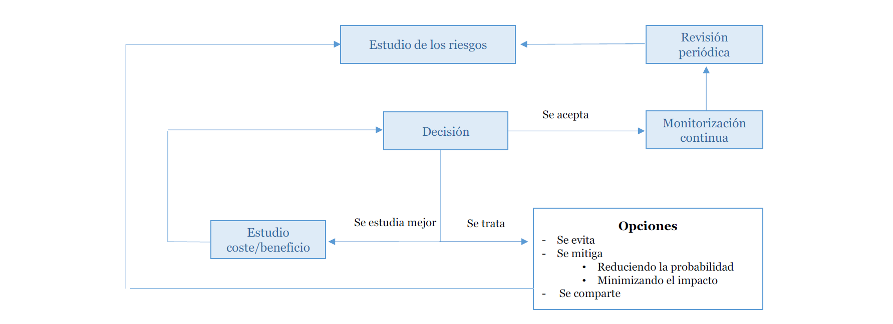
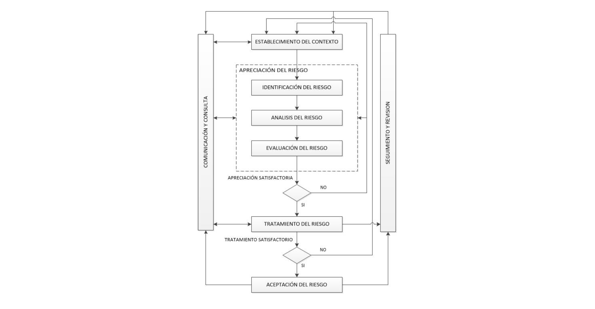

# Tema 2: Metodologías y herramientas de análisis y gestión de riesgos

## 1. MAGERIT

- Metodología de carácter público
    - Desarrollada por el Ministerio de Administraciones Públicas (MAP)
    - Pensada para el ENS y las AAPP pero aplicable a cualquier empresa
- Implementa el proceso de gestión de riesgos enfocado a tecnologías de la información
- Define 3 fases:
    1. Planificación del proyecto
    2. **Análisis de riesgos**
    3. **Gestión de riesgos**
- MAGERIT es una **metodología centrada en el activo**

> Activo (MAGERIT): «Componente o funcionalidad de un sistema de información susceptible de ser atacado deliberada o accidentalmente con consecuencias para la organización. Incluye: información, datos, servicios, aplicaciones (software), equipos (hardware), comunicaciones, recursos administrativos, recursos físicos y recursos humanos»

### Análisis del riesgo en MAGERIT

- MAGERIT establece una aproximación metódica para **analizar el riesgo**:
    1. Caracterización de los **activos** (*activos relevantes para la organización: valor, coste de degradación, ...*) [MAR.1]
        - **Identificación**
        - ***Dependencias***
        - **Valoración**
    2. Caracterización de las **amenazas** (*a que amenazas están expuestas esos activos*) [MAR.2]
        - **Identificación**
        - **Valoración**
    3. Caracterización de las **salvaguardas** (*qué medias hay implementadas y su eficacia*) [MAR.3]
        - **Identificación**
        - **Valoración**
    4. **Estimación** del estado del riesgo [MAR.4]
        - Estimación del **impacto**
        - Estimación del **riesgo**

### Gestión del riesgo en MAGERIT

- **Tomar decisiones** con respecto a los siguiente **factores**
    - El **nivel de riesgo**
    - La **gravedad** del impacto
    - Las **obligaciones** legales y reglamentarias
    - Las obligaciones contractuales
- Calificar los riesgos y las acciones a tomar
    | Calificación del riesgo   | Acción            |
    |---------------------------|-------------------|
    | Crítico                   | Atención urgente  |
    | Grave                     | Atención          |
    | Apreciable                | Objeto de estudio |
    | Asumible                  | No tomar acción   |

- Diagrama de toma de decisiones

## 2. ISO 27005

- *ISO 27005: Risk Management of Information Security*
    - Norma de la familia ISO 27000
- Define un **ciclo para la gestión del riesgo** y como llevar a cabo el **análisis y el tratamiento de riesgos**

- Dos aproximaciones para la apreciación de riesgos:
    - *Alto nivel*
    - *Detallada*

### Aproximación de alto nivel

- Permite definir las prioridades y la cronología de acciones
- Puede ser prematuro iniciar una apreciación detallada
- Permite ahorrar costes en un comienzo
- Facilita la sincronización de la apreciación del riesgo con otros plantes de gestión (planes de gestión de cambio, continuidad de negocio, etc.)
- *Características*:
    - Proporciona una **visión más global** de la organización y sus sistemas
    - **Lista más limitada** de amenazas y vulnerabilidades agrupadas en dominios
    - Permite contemplar los **riesgos mas generales**
    - Es **más apropiada** para proporcionar **controles organizativos** y no técnicos
- *Ventajas*:
    - **Facilita la aceptación** del programa de apreciación de riesgos
    - **Facilita** la elaboración de una **visión estratégica** del programa de seguridad de la información de la organización
    - Ayuda a **priorizar** el uso de los **recursos**
- *Desventajas*:
    - Algunos **procesos o sistemas** pueden **no ser identificados**
- *Se puede ver si es adecuada en base a*:
    - Los objetivos de negocio
    - El **grado de dependencia** de los negocios de la organización en los activos de información
    - El nivel de inversión en cada activo
- Si tras su aplicación se ve necesario, se puede optar por una **segunda iteraciones con la aproximación detallada**

### Aproximación detallada

- Consiste en:
    - **Identificación y valoración en profundidad de los activos**
        - **Evaluación** de las **amenazas** a la que están expuestas dichos activos
        - **Evaluación** de sus **vulnerabilidades**
- Suele requerir **mucho tiempo, esfuerzo y experiencia**
- Para evaluar la probabilidad de materialización de una amenaza, que depende de:
    - El **atractivo del bien** o el posible **impacto**
    - La **facilidad de obtención de beneficio** por parte del atacante de la explotación de la vulnerabilidad
    - Las **capacidades técnicas** del **atacante**
    - La **facilidad de explotación** de la vulnerabilidad
Existen muchos métodos para ello
    - Cuantitativos
    - Cuantitativos
    - Combinación

## 3. NIST 800-39

- *NIST SP 800-39*:
    - *Managing Information Security Risk: Organization, Mission, and Information System View*
    - *Gestión de riesgos de seguridad de la información: vista de organización, misión y sistema de información*
- **Gestión de riesgos de la organización**, que incluye:
    - **Marco de referencia** del riesgo
        - Elaborar una **estrategia de gestión de riesgos** para: evaluar, responder, monitorizar
    - **Evaluación** de riesgos
        - **Amenazas** a las que está expuesta
        - **Vulnerabilidades** (internas y externas)
        - **Impacto**
        - **Probabilidad**
    - **Respuesta** a los riesgos
        - Desarrollar y evaluar respuestas
        - Determinar las respuestas apropiadas
        - Implementar las respuestas seleccionadas
    - **Seguimiento** de los riesgos
        - Valorar de forma continua la efectividad
        - Identificar los cambios
        - Verificar que se han implementado las respuestas

## 4. NIST 800-30 Rev. 1

- *NIST SP 800-30 Rev. 1: Guide for Conducting Risk Assessments*

### *Enfoques* para la evaluación del riesgo

- *Cuantitativo*:
    - Valores numéricos
    - Análisis coste/beneficio más efectivo
    - Puede que requiera una interpretación y explicación
    - Subjetividad
- *Cualitativo*:
    - Niveles no numéricos
    - buen enfoque para la comunicación de los resultados
    - Dificulta la priorización
- *Semicuantitativo*:
    - Agrupaciones numéricas
    - Se pueden combinar los beneficios de los dos enfoques
    - Más ayuda a la priorización que en un enfoque cualitativo

### *Aproximaciones* para la evaluación del riesgo

- Orientada **a amenazas**
    1. Identificación de las fuentes y los eventos de las amenazas
    2. Las vulnerabilidades se identifican dentro el contexto de las amenazas
    3. Los impactos se identifican en función de la intención del atacante
- Orientada **al impacto** en el activo
    1. Identificación de los impactos sobre los activos críticos
    2. Utiliza los objetivos de negocio o resultados de un análisis de impacto en el negocio
- Orientada **a la vulnerabilidad**
    1. Identificando debilidades y deficiencias explotables en los sistemas de información
    2. Identifica las amenazas y condiciones necesarias para explotar esas vulnerabilidades

### *Fases* para la evaluación del riesgo

1. **Preparación**
    - *Objetivo*: **establecer el contexto** para la evaluación de riesgos
    - *Tareas*:
        - Identificar propósito
        - Identificar alcance
        - identificar supuestos y limitaciones
        - Identificar fuentes de información (inputs)
        - Identificar el modelo de riesgo (modelos de evaluación)
2. Ejecución
    - *Objetivo*: **estimar el riesgo**
    - *Tareas*:
        - Identificar origen y eventos de la amenaza
        - Identificar vulnerabilidades
        - Estimar probabilidad
        - Estimar impacto
        - Estimar riesgo
3. **Comunicación de resultados**
    - *Objetivo*: garantizar que los responsables de la toma de decisiones tengan toda la información necesaria
    - *Tareas*
        - Comunicar los resultados
        - Compartir información
4. **Mantenimiento**
    - *Objetivo*: mantener **actualizado** el conocimiento especifico del riesgo
    - *Tareas*:
        - Motorización continua
        - Actualización de la evaluación de riesgos
