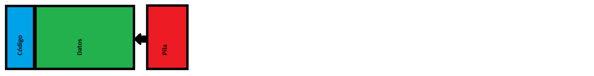
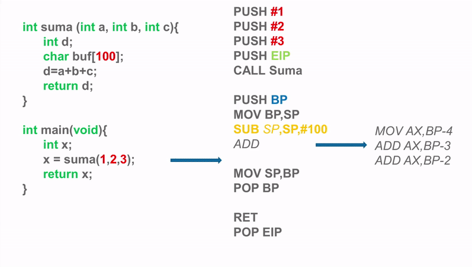
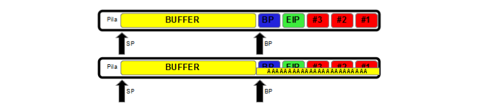

# Tema 2: Vulnerabilidades

## 1. Análisis de vulnerabilidades

- Existen **herramientas** integrales que permiten **escanear vulnerabilidades** en sistemas o redes enteras
- Este proceso también se puede hacer de manera manual o más artesanal (probando técnicas, lanzando escaneos, etc)
    - Pero estas herramientas centralizan y simplifican el proceso

### Nessus

- La más popular de todas,
    - Escaneo de vulnerabilidades **muy simple pero muy versátil** y potente
- Interfaz web
    - Permite lanzar escaneos desde ahi
    - Obtener reportes e información desde ahi
        - Potente **generación de informes**

### OpenVAS

- Alternativa Open Source
- Surge de un fork cuando Nessus se vuelve de pago

### Nexpose

- De los creadores de Metasploit
- Funciona como las anteriores
- Comprueba si, cuando detecta una vulnerabilidad, se encuentra en la BD de Metasploit

## 2. Metasploit

- **Payload**: código que tiene el fin de **comprometer una máquina** externa tras haber sido penetrada
    - *Shellcode*: tipo de payload que genera una shell en la víctima accesible remotamente
- **Exploit**: Software, script o procedimiento que aprovecha una vulnerabilidad y con el que se puede comprometer un sistema
    - *Activos*: explotarán una máquina objetivo por fuerza bruta hasta inyectar el payload o encontrar un error
    - *Pasivos*: eseran a que una máquina víctima se conecte a la máquina host para explotarlos
- **Metasploit**
    - Plataforma para desarrollar y ejecutar exploits contra una máquina remota
    - Generación de shellcodes
    - Interacción con la máquina remota
- **Meterpreter**
    - Payload que provee de una shell interactiva
        - Reside totalmente en memoria RAM, (no deja rastro en el disco duro ni
        - Se inyecta en el proceso comprometido y puede migrar a otros
        - Utiliza comunicaciones cifradas entre la víctima y el atacante

### Herramientas de Metasploit

- **MsfConsole**
- Interfaz por consola,
    - La más usada y flexible
- **Armitage**
    - Potente herramienta para manejar Metasploit de una forma gráfica
- **MsfUpdate**
    - Para actualizar Metasploit
- **Msfvenom**
    Herramienta para crear y codificar payloads

### Comandos Metasploit

- `show all`
- `show exploits`
- `show payloads`
- `show auxiliary`
- `show encoders` → Algoritmos que se ejecutan sobre los payloads para ofuscarlos
- `show options` → Muestra las opciones sobre un exploit
- `show advanced`
- `use [path_del_exploit]` → Para seleccionar un exploit
- `info` → Sobre el exploit seleccionado
- `search [palabra]` → Para buscar. Aconsejable unto al parámetro «type»: `search type:exploit mp4`
- `set [opcion] [valor]` → Definiremos las opciones requeridas por los módulos de exploit, payload...
- `unset [opcion]` → Elimina un parámetro
- `exploit`/`run` → Ejecuta el exploit
- `sessions` → Para interactuar con las máquinas explotadas
- `back` → Permite volver atrás en los módulos

### Comandos Meterpreter

- `help`
- `background` → Pasa a segundo plano la sesión
- `ps` → Muestra los procesos activos
- `sysinfo` → Muestra información del sistema en el que estamos
- `getuid` → Muestra los permisos con los que contamos en la sesión actual
- `getpid` → Indica el pid del proceso al que estamos conectados
- `migrate` → Migrar a otro proceso para no perder la sesion
- `ipconfig` → Muestra las interfaces de red y las direcciones de la máquina remota
- `idletime` → Tiempo de inactividad del usuario remoto
- `pwd/ls/cd/mkdir/rm/rmdir`
- `run hashdump` → Obtener los hashes de las contraseñas del sistema
- `upload/download` → Para subir y bajar archivos de la máquina remota
- `screenshot`
- `run vnc`
- `keyscan` → Captura las pulsaciones del equipo remoto
- `load sniffer`
- `run webcam`
- `run sound_recorder`
- `clearev` → Borrar todo el rastro que pueda dejarse en la víctima
- `timestomp` → Permite modificar la fecha de un archivo
- `run get_application_list` → Lista de aplicaciones instaladas
- `reg` → Acceder a los valores del registro de Windows
- `shell` → Obtener una shell en la máquina remota
- `run killav` → Desactiva los módulos del antivirus del sistema remoto

### Explotación

#### Directa

- Se explota **directamente** desde la máquina del atacante
    - Dos tipos de Shell
        - **Reverse Shell**
            - La víctima se conecta al atacante
            - Es más fiable
                - Suele haber menos restricciones hacia afuera que hacia adentro
            - No requiere abrir puertos en la víctima
        - **Bind shell**
            - Requiere abrir un puerto en la víctima
                - Puede llamar la atención
            - El atacante se conecta a la víctima

#### Client-Side

- Forzar a que la víctima se conecte a un servidor vulnerado
- El servidor vulnerado es el que provee el payload y realiza la explotación

#### Explotación local

- Una vez explotado el sistema, y se tiene acceso al sistema, se puede llegar a una de las siguientes opciones:
    - Administrador real (ID=500, UID=0)
    - User grupo administradores
    - User sin privilegio
- En función del tipo de usuario que se sea, se puede optar por dos opciones:
    - **Elevar privilegios**
    - Dar por exitosa la prueba de penetración mediante ese vector
        - Desplazamientos horizontales
        - Intentar obtener otros recursos
- Tras haber explotado la máquina, se pasaría a la fase de **post-expolotación**F

### Escalada de privilegios

- Númerosas técnicas de escalada de privilegios en una máquina, como por ejemplo:
    - Bypass UAC
    - Pass-the-hash

#### Bypass UAC

- Consiste en buscar alguna manera de **saltarse el UAC para elevar privilegios**
    - ¿Como?
        - Muchas técnicas
            - Una de ellas consiste en saltar a un proceso que no requiera UAC para realizar labores de administracion (como un proceso firmado por Microsoft)

#### Pass-the-hash

- Consiste en buscar alguna manera para poder acceder a algún sistema desde el punto en el que se está
- Sistemas de autenticación como NTLM solo requieren usar el hash para loguearse
    - Extraer hash de la memoria (Mimikatz)

## 3. Tipos de vulnerabilidades

### Vulnerabilidades de código

- **Factores** a tener en cuenta en una vulnerabilidad de código
    - **Producto**: A qué productos afecta
    - **Dónde**: Dentro del sistema o del programa, donde se halla
    - **Causa y consecuencia**: Fallo técnico concreto que se cometió
    - **Impacto**: Hasta donde se puede llegar o que puede lograr un atacante
    - **Vector**: Forma que tiene el atacante de aprovechar la vulnerabilidad
- **Ejemplo**:
    - *Producto y versión*: MSPaint 7
    - *Causa / Consecuencia*: Se omite la comprobación del parámetro tamaño (causa) y se produce un desbordamiento de memoria intermedia (consecuencia)
    - *Dónde*: En la función SetImageSize del componente image_size.dll. (librería usada por mspaint.exe)
    - *Impacto*: Ejecutar código arbitrario
    - *Vector*: Envío de un archivo de imagen manipulado (con el código que quiere ejecutar incrustado en su interior, y el parámetro incorrecto retocado) a la víctima, y ésta abrirla

### Heap Overflow

- Causada por un **mal uso de la memoria dinámica**
    - A usar funciones como como `malloc` o `free` (C/C++)

#### Use after free

- Cuando un programa **continúa utilizando un puntero** después de haber sido liberado (con `free()`)
- Se puede usar la técnica **Heap Spraying**:
    - **Llenar el HEAP de NOPs y shellcodes**
    - **Resbalar** desde los NOPs hasta un shellcode

```cpp
int *get_pointer(int *ant)
{
    int *b = (int *)malloc(sizeof(int));
    if (ant == NULL)
    {
        free(b); // liberamos b si ant es null
    }
    else
    {
        *b = *ant;
    }
    return b // problema si ant es null
}
```

#### Dereference after free

- Tipo concreto de *use after free*
    - Al intentar acceder a memoria dinámica previamente liberada por un `free()`

##### Double free

- Cuando **se libera un puntero más de una vez**
- Se corrompe la estructura de datos
    - Sobrescribir valores para alterar el flujo

```cpp
int * ab = (int*)malloc(SIZE);

//...

if (c == 'EOF')
{
    free(ab); // Liberamos la primera vez
}

//...

free(ab); // Volvemos a liberar
```

### Off-By-One

- Uso incorrecto de un valor por +-1
    - Mala programación al iterar estructuras de datos (pasarse del array o [-1])
- **Normalmente *crashea*** el programa
    - En ocasiones se pueden aprovechar para eludir restricciones o ejecutar código

```cpp
int crash (char *param)
{
    char st[64];
    if ( strlen(param) > 64 )
    {
        printf("Argumento demasiado largo");
        exit(0);
    }
    strcpy(st, param); // La función strcpy siempre añade ‘\0’ al final 
                       // Si param tiene tamaño 64 este carácter 
                       // sobrescribirá otra zona de memoria
    return 0;
}
```

### Race condition

- Producidos por el cambio que experimenta el estado de un recurso (fichero, memoria, registros, ...)
- El atacante puede **influir en este cambio de estado** entre la comprobación y uso
- Suelen darse bien por temas entre **hilos** o bien por la concurrencia de **procesos**
- **El ejemplo más común** es un proceso que modifica un **archivo**

```cpp
if(!access(file,W_OK))              // 1. Comprueba el acceso al archivo
{
    fich = fopen(file,"W+");        // 2. Abre el archivo
    modificar_fichero(fich);
}                                   // El proceso llega a 1 y tiene permiso. Pierde la 
else                                // CPU y el otro proceso modifica el nombre
{                                   // del archivo. El primer proceso al tomar la CPU
    fprint(stderr,"Sin permiso");   // de nuevo llegará a 2, no comprobará de nuevo 
}                                   // si tiene el permiso y abrirá el archivo
```

### Integer Overflow

- Desbordamientos de enteros cuando no se controlan
    - Inputs de usuario, etc.
- **No suelen dar en si problema**s de seguridad (peta u overflow y ya)
    - **Solo cuando** esas variables **se usan para** tomar decisiones
        - Asignar memoria, indices de arrays, etc.

```cpp
unsigned int x = 0xffffffff; // x tiene el mayor valor de un unsigned int
unsigned int y = 0x5;
unsigned int z = x + y; // Desbordamiento de entero
// z = (x+y) mod (tamaño unsigned int)
// z = (x+y) mod 0x100000000 = 0x100000004 mod 0x100000000 = 0x4
```

### Format String

- Se da en lenguajes como C
    - En los que se usan modificadores para formato (`%d`,`%s`, ...)
- Problema **cuando no se controla la salida** y se cuelan esos modificadores
- **Meter modificadores en la entrada** para que en la salida **se desborde**

```cpp
#include <stdio.h>
int main(void)
{
    char texto[30];
    int a = 1;
    int b = 2;
    int c = 3;
    scanf("%29s", texto);
    printf(texto); // No da formato al texto leído para imprimirlo
    return 0;
}
```

```bash
$ ./vulnerable                              # Ejecutamos el programa
%x_%x_%x_%x_%x_%x_%x_%x … _%x               # Introducimos el valor del formato
*** stack smashing detected ***: ./vulnerable terminated ...    
# El programa crashea
bffff518_bffff508_8048378_b7ff1030_8049ff4_bffff538_3_2_1_255f7825 Aborted 
# Obtenemos los datos de la pila como valores y direcciones
```

### Buffer Overflow

- Cuando se copia cierta cantidad de **datos** sobre un **área** que **no es lo suficientemente grande** para contenerlos
- Normalmente en la zona de la **pila**.

```cpp
int main ()
{
    char strl [10] ;    // Declaramos una variable con tamaño de 10 caracteres (bytes)
                        // a continuación, copiamos 35 bytes de "A" a strl
    strcpy (strl, "AAAAAAAAAAAAAAAAAAAAAAAAAAAAAAAAAAA");
}
```

## 4. Buffer Overflow

### x86

#### Banco de Registros

```text
|---------------|---------|---------|   |---------|
| EAX           | AX (AH) | AX (AL) |   | CS      |
|---------------|---------|---------|   |---------|
| EBX           | BX (BH) | BX (BL) |   | DS      |
|---------------|---------|---------|   |---------|
| ECX           | CX (CH) | CX (CL) |   | SS      |
|---------------|---------|---------|   |---------|
| EDX           | DX (DH) | DX (DL) |   | ES      |
|---------------|---------|---------|   |---------|
| ESI           | SI                |   | FS      |
|---------------|-------------------|   |---------|
| EDI           | DI                |   | GS      |
|---------------|-------------------|   |---------|
| EBP           | BP                |
|---------------|-------------------|
| ESP           | SP                |
|---------------|-------------------|

|---------------|-------------------|
| EFLAGS        | FLAGS             |
|---------------|-------------------|

|---------------|-------------------|
| EIP           | IP                |
|---------------|-------------------|
```

- 8 Registros de propósito general
    - **AX, BX, CX, DX**: Operaciones aritméticas
- **SI, DI, BP, SP**: Registros de dirección
- **SI**: Dirección origen
- **DI**: Dirección destino
- **BP**: Puntero a base de la pila
- **SP**: Puntero a pila
    - PUSH/POP
- Registro de **Flags**
- **Puntero de instrucción**
- **Segmentos de memoria**
- Se puede acceder a **medio registro** (**AH – AL**)
- Windows utiliza un esquema de memoria plana
    - CPU puede referenciar de manera directa todas las direcciones de memoria

#### Instrucciones x86

```assembly
NOP             ; No hace nada

MOV AX, 0x8000  ; Almacena lo que hay en la dirección de memoria 8000 en el registro AX

ADDB AX,BH,BL   ; Suma BH y BL y lo guarda en AX

PUSH AX         ; Guarda el dato almacenado en AX en la pila
                ;       De manera implícita "suma" 1 posición de memoria a SP

POP AX          ; Guarda el primer elemento de la pila en AX (LIFO)
                ;       De manera implícita "resta" una posición de memoria a SP

JMP 0x8048b70   ; salto incondicional (EIP)

JNEZ 0x8048b70  ; Salta si el flag de cero no está activado (Reg. Flags)

CALL Subrutina  ; Llama a la subrutina que está en la dirección indicada por la etiqueta "Subrutina"
                ;       De manera implícita PUSH EIP

RET             ; Retoma la ejecución en el punto donde se ha quedado antes de llamar a la subrutina
                ;       De manera implícita POP EIP
```

### Orden de los bytes en memoria

- Existen varias convenciones a la hora de guardar información en la memoria principal
    - *Endianess*
        - **Big Endian**: Empieza guardando el MSB
        - **Little Endian**: Empieza guardando el LSB


### Modelo de memoria segmentada



- Cuando se inicia una aplicación **se crea un proceso** y se le asigna un **trozo de memoria**
    - Una reserva por cada proceso
- Segmento de **código**:
     - Almacenará las **instrucciones** del proceso (Read Only)
- Segmento de **datos**
    - Almacena las **variables globales y estáticas**
- Pila
    - En este espacio también está el Heap (Memoria dinámica (`malloc()`)
    - Guarda las variables locales y datos de control
        - La pila **decrece en memoria**

### Ejemplo de uso de Pila

- El siguiente ejemplo:

```cpp
int suma (int a, int b, int c){
    int d;
    char buf[100];
    d = a + b + c;
    return d;
}
int main(void){
    int x;
    x = suma(1, 2, 3);
    return x;
}
```

- Si se compila da algo como esto:

```assembly
PUSH #1
PUSH #2
PUSH #3
PUSH EIP    
CALL Suma

PUSH BP
MOV BP, SP
SUB SP, SP, #100
ADD

MOV SP, BP
POP BP

RET
POP EIP
```

- Si se ejecuta, se puede ver lo que pasa con la memoria linea a linea:



- A remarcar:
    BP es el puntero a la base de la pila
    SP es el puntero a la pila

### Ejemplo de Buffer Overflow

```cpp
int suma (int a, int b, int c, char *Buffer) {
    int d;
    char buf[100];
    strcpy(buf, Buffer);
    d = a + b + c;
    return d;
}
int main(int argc, char **argv) {
    int x;
    x = suma(1, 2, 3, argv[1]);
    return x;
}
```

- El programa de arriba tiene la vulnerabilidad de Buffer Overflow
    - No controla la entrada, por lo que se puede menter más de la cuenta
- Si `strcpy` copia Buffer en `buf` hasta que encuentra un carácter de fin de String:
    - ¿Qué sucederá con la pila?
- Si se ejecuta el código de la siguiente manera:

```bash
gcc programa.c –o programa
./programa AAAAAAAAAAAAAAAA..........
```

- Ocurre un desbordamiento de pila



## 5. Mecanismos de protección

### Programación segura

- Es la **forma más efectiva** y segura de todas
- Invertir tiempo en la seguridad de las aplicaciones
- Aspectos a controlar:
    - Se debe **controlar la entrada de datos** al usuario para no desbordar buffers ni
variables
    - Invertir tiempo en **realizar test** de pruebas para detectar posibles fallos.
    - Tener un **control exhaustivo de errores** y excepciones
    - **Evitar** el uso de **funciones deprecated** e inseguras de C, como: `strcpy()`, `strcat()`, `sprintf()`, `scanf()`, ...
        - Usar librerías con funciones seguras como Libsafe
    - Otorgar los **mínimos privilegios necesarios** en una aplicación
        - Si todas las medidas de seguridad fallan, que el **daño sea mínimo**

### DEP (Data Execution Prevention)

- Ayuda a **evitar la ejecución del código desde las páginas de datos**
- Normalmente, el código no se ejecuta desde el Heap ni la pila
- Dos tipos:
    - Por HW:
        - **Detecta código** que se está ejecutando desde estas ubicaciones y  **produce una excepción**
            - **XD/NX** Intel o AMD (eXecute Disable o No Execute)
    - Por SW:
        - Reimplementación de funciones inseguras
            - Ejemplo: **Libsafe**
        - Deteccion de ejecucion de código ilegítimo en la pila
            - Ejemplo: **SecureStack**

### Stack/Canary Cookies

- Medida complementaria a DEP
- **Añadir un valor en el stack** para comprobar que el mismo no es sobreescrito.
- Modificar la forma en la que el compilador genera el "prólogo" y el "epílogo" de las funciones

### ASLR (Address Space Layout Randomization)

- Es una medida dirigda a **dificultar aún más** ejecución de código malicioso
- Consiste en generar **direcciones de memoria aleatorias** para un proceso (la pila, el heap, las DLL, ...)
    - Para que no se pueda saltar a direcciones absolutas
