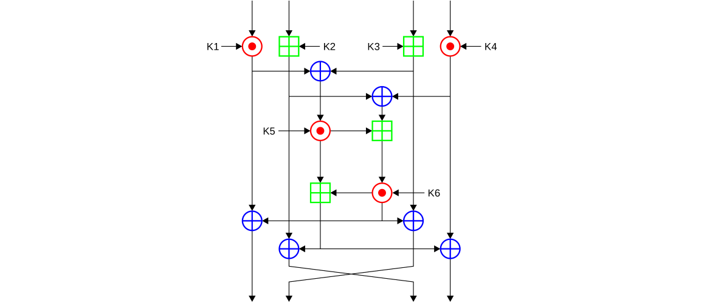

# Tema 3: Algoritmos de cifra simétrica

## 1. Generalidades de la cifra en flujo


- Componentes del cifrado en flujo:
    - Algoritmo de cifrado y descifrado con la función XOR
    - Secuencia cifrante
        - (*infinita y aleatoria*: ideal pero **imposible**)
        - **Pseudoaleatorio y mucho más grande que el mensaje**
            - K semilla = **clave secreta**
                - (fase de la secuencia cifrante, ~200bits)
    - **Una misma operación** para cifrar y para descifrar

### Postulados de Golomb

- *G1*: mitad 0 y mitad 1
- *G2*: Efectos de rachas. La aparición de 0 o 1 es 1/2
- *G3*: Autocorrelación fuera de fase

### Registros de desplazamiento

- **LFSR: Linear Feedback Shift Register**
    - Puesta XOR
    - Periodo (LFSR) `2^n -1`

    

    

- NFSR (non linear)
    - Incluyen otras puertas lógicas → Periodo máximo

## 2. Algoritmos de cifra en flujo (A5, RC4)

### A5


- **3 registros LFSR** primitivos de 19, 22 y 23 bits
- 64 bits en total (semilla)
    - semilla **muy pequeña**
- Para que la salida de bits en el XOR de los tres registros sea menos predecible:
    - *Función mayoría*
        - C1 = bit 9 R1
        - C2 = bit 11 R2
        - C3 = bit 11 R3
        - Solo se desplazan los que tengan el bit que de mayoría
            - Si C1 = 1, C2 = 1 y C3 = 0 → Mayoría 1 → NO se desplazan el registro en minoría (en este caso R3)
            - Si todos son iguales → se desplazan todos
- No se usa (roto)

### RC4


- Dos rutinas:
    - **KSA**: para generar la clave
    - **PRGA**: para cifrar cada byte del texto en claro con un nuevo byte de la secuencia de clave

```cpp
for i from 0 to 255
    S[i] := i 
endfor 
j := 0 
for i from 0 to 255
    j := (j + S[i] + key[i mod keylength]) mod 256
    swap values of SW and S[j]
endfor 
```

```cpp
i := 0 
j := 0 
while GeneratingOutput:
    i := (i + 1) mod 256
    j := (j + S[i]) mod 256 
    swap values of S[i] and S[j] 
    K := S[(S[i] + S[j]) mod 256] 
    output K 
endwhile 
```

## 3. Generalidades de la cifra en bloque

- La información a cifrar o texto en claro se **agrupa en bloques** n de bits
    - Bloque en claro → bloque cifrado
- Para garantizar que se mezcle lo suficiente
    - Varias vueltas
        - Algoritmo de expansión de clave
        - *Efecto avalancha*


### Rellenos

- Normalmente el ultimo bloque va a quedar incompleto
- Para rellenarlo, la tecnica depende del algoritmo de cifrado
    - DES → `0` padding
    - AES → PKCS7

### Modos de cifra

### ECB (Electronic CodeBook)


- Modo estándar del código fuente
- **Vulnerable** a ataques (error de transmisión sólo a un bloque)
- **Prohibido** su uso

### CBC (Cipher Block Chaining)


- Vector inicial (IV - segunda clave tamaño bloque)
- Un error en la transmisión afecta al resto del criptograma
- No se puede paralelizar

### CTR (Counter mode encryption)


- Evita el problema del paralelismo y error en la transmisión que afecta a todo el criptograma

## 4. Algoritmos de cifra en bloque (DES, 3DES, IDEA, AES)

### DES

- **Bloques de 64 bits** divididos en dos bloques de 32 bits
- **Clave 64 bits** (en realidad 56 debido a limitaciones con bits de paridad)
- **Cifrador Feistel** (magic!)
    - Se descifra con el mismo esquema
- Funcionamiento:
    - Generación de las 16 claves
        - Sustitución y permutación selectiva
    - **Función F**
        - Ampliación de 32 bits
        - XOR con ki
        - **8 Cajas S**
        - Permutación final
    - **Cajas S**
        -Entrada total: 48 bits (extendidos)
        - Cada caja:
            - 6 bits de entrada
            - 4 bits de salida
            - Matrices ya definidas que en función de la entrada y la salida dan un número concreto

#### Esquema DES


#### Funcion F DES


#### Cajas S


#### Des challenges

- Diversos ataque a DES
- El problema principal es que la clave es muy pequeña
- DES Cracker + distributed.net (100000 PCs) → **22 horas** para romperlo (~250000M k/s)

### 3DES

- Busqueda de sustitutos para DES
- Doble DES aumenta sólo 1 bit la clave
    - Meet in the middle (conocer C’)

    

- 3DES sirve como solución


### IDEA

- Entrada
    - **Bloque de 64 bits** M
    - **Clave de 128 bits**
- Proceso
    - División de M en 4 bloques de 16
    - 52 subclaves de 16 bit
    - 8 vueltas y 6 claves en cada una
    - Transformación final (4 claves restantes)
- Generación 52 subclaves:
    - (8) 128 bloques de 16
    - Desplaza 25 bits (x6)



### AES

- Algoritmo Rijndael
- Entradas:
    - **Bloque 128 bits**
    - **Clave 128, 192 o 256**
        - Expansión
- Proceso:
    - *SubBytes*
    - *ShiftRows*
    - *MixColumns*
    - *AddRoundKey*
- Vueltas
    - 10 (128 bits)
    - 12 (192 bits)
    - 14 (256 bits)


#### AES SubBytes

- Introduce no linealidad
- Similar a DES pero no es una caja fija (matriz de 16x16, 256 celdas)


#### AES ShiftRows

- Aumenta la difusión


#### AES MixColumns

- Multiplicación en GF(2^8) Introduce no linealidad
- Matriz inversa


#### AES AddRoundedKey

- Cada subclave (siempre tamaño 128 bits) se combina XOR con el estado


