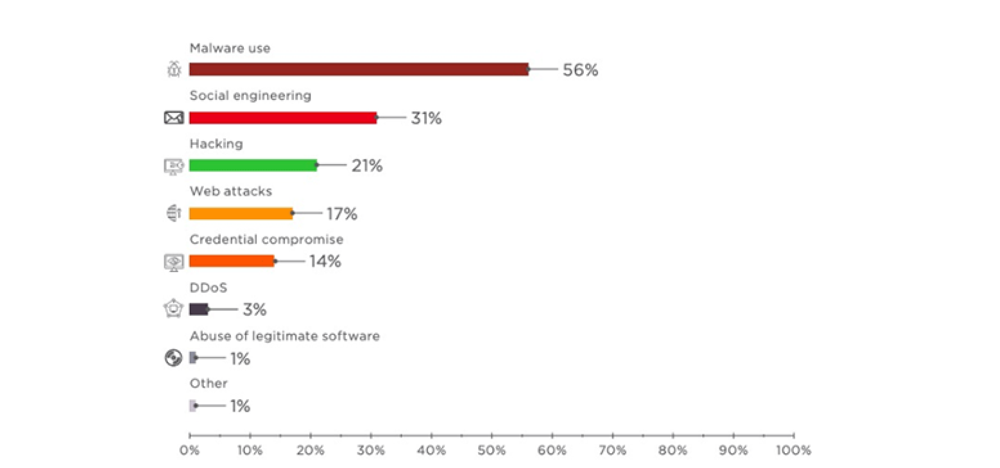

# Tema 3: Tipos delictivos II

## 1. Daños informáticos

- Existen innumerables vías de comisión de delitos relacionados con daños informáticos
- Algunas de las más comunes y actuales son:
    - Difusión de malware
    - APT
    - Botnets
    - Ransomware

### Malware

- Software específicamente diseñado para permitir el **acceso y posterior manipulación** de un sistema informático, **sin el conocimiento ni autorización** de su propietario
- Se distribuyen, principalmente, de dos maneras:
    - A través de **técnicas de ingeniería social**
    - Explotando **vulnerabilidades** de los sistemas
- Es una de las amenazas más comunes

- Los tipos y la complejidad del malware ha aumentado con los años
    - Especímenes polimórficos
- Nuevos dispositivos y sistemas a tener en cuenta
    - Smartphones y tablets

### Advanced Persistent Threat (APT)

- Conjunto de medios y técnicas utilizadas como parte de un sofisticado ciberataque dilatado en el tiempo
- *Características*:
    - Amenazas **dirigidas**
        - Están enfocadas a un objetivo concreto
        - Los objetivos y motivos son claros y definidos
    - Amenazas **avanzadas**
        - Se hacen uso de **diferentes vectores** de ataques
        - El acceso a los sistemas es escalonado y con **técnicas variadas**
        - Uso de múltiples técnicas de **ingeniería social, malware y exploits avanzado**
    - Amenazas **persistente**
        - El ataque se **mantiene en el tiempo**
        - Hace **frente a las nuevas defensas** que puedan surgir
- Está en **constante mutación**
    - Se adapta continuamente a las características de los sistemas a atacar
- Son tipos de amenazas que pueden afectar a cualquier tipo de organización
- **Fases** (*The advanced persistent thread, Mandiant*)
    1. **Reconocimiento**
        - Recopilación de información
            - OSINT (footprinting)
            - Fingerprinting
        - Obtener conocimientos del entorno
        - Estudiar objetivos y vectores de ataque
            - Personas
            - Sistemas
    2. **Intrusión inicial** en la red
        - Usar las técnicas más adecuadas como primer paso
            - Ingeniería social (phishing)
            - Vulnerabilidades explotables
    3. Establecer un **backdoor** en la red
        - Obtener credenciales de administrador
        - Instalar puertas traseras para garantizar acceso continuado
            - Actualizar el malware ante medidas de seguridad
        - Configuración para interactuar con un C&C
    4. Obtención de **credenciales de usuario**
        - Obtener credenciales de usuario para acceder a sistemas concretos
    5. **Explorar e instalar utilidades**
        - Instalar herramientas para poder obtener control de los equipos
        - Un mundo de posibilidades
    6. **Escalada** de privilegios/**movimiento** lateral/**extracción** de datos
        - Procesos de expansión para poder ir adquiriendo acceso a nuevos equipos
    7. **Mantener persistencia**
        - Seguir configurando medidas para:
            - Ocultarse
            - Mantenerse dentro
- Las fases **son cíclicas**

### Botnet

- **Red de ordenadores infectados** por un malware que permite que **sean controlados de manera coordinada** y remota por parte de un atacante o *botmaster*
- **Etapas** para crear una botnet:
    1. Definir tipo de red
        - Finalidad
        - Medios técnicos
    2. Decidir malware a usar
        - Malware para infectar los equipos y tomar su control
    3. Distribuir el malware
        - Estudiar mejores medios para ello (correo electrónico, documentos infectados, web, etc.)
        - Cuantos más equipos infecte más potente será la red
- **C&C** (Command and Control)
    - Permiten controlar los equipos de la red y mandarles ordenes
    - Consiste en uno o más servidores que se comunican con los bots
- Formas de **comunicación C&C ⟷ bots**
    1. **Backdoors**
        - Más potentes pero más complejas de mantener
    2. Conexiones **HTTP**
        - Pasan desapercibidas fácilmente
        - Limita posibilidades (comandos ya programados)
    3. Métodos más complejos (usar mensajes en foros, RRSS, etc.)
        - Muy complejo
- **Utilidades** de una botnet:
    - Envío masivo de **spam o phishing**
    - **DDoS**
    - **Distribuir malware**
    - Distribuir **contenido ilícito** (PI, CP, etc.)
    - Ofrecer servicios **a terceros**

### Ransomware

- Tipo de **malware** que **bloquea el acceso a sistemas o archivos** y exige un **rescate** para liberarlos
    - La técnica de bloqueo **mas común** es el uso de **cifrado**
- Origen y evolución
    - Más sofisticados con el tiempo
    - Tendencia a ser ataques más dirigidos
    - Uso de cifrado generalizado
    - Rentables (económicamente)
        - Relativo poco coste
        - Potencial beneficio muy alto
    - Ejemplos destacados
        - Wannacry
        - Ryuk
- Cobro del rescate
    - *Antes*
        - Ukash, Paysafecard
    - *Ahora*
        - Criptodivisas
        - Completamente anónimo
        - Todas las operaciones son rastreables, pero:
        - No se puede asociar los monederos a personas
- Desinfección
    - Dependiendo del ransomware ( y sus vulnerabilidades) **se puede llegar a descifrar** los archivos
    - El mejor mecanismo para mitigar son los **backups**
        - Más otros mecanismos para defenderse ante malware

### Cryptojacking

- **Malware** que se oculta o infecta sistemas para **minar criptodivisas**
- Varios tipos
    - Infectar equipos
    - Infectar webs
        - Inyectar script JS
        - Diferentes técnicas para hacerlo (XSS, etc.)
        - Permite llegar a muchos usuarios fácilmente

## 2. Propiedad intelectual

- **No todas las difusiones** de contenidos protegidos bajo los derechos de autor **son considerados delictivos**
- Las penas por piratería (sea o no a través de internet) se legislan en **Artículos 270-272 del CP**
- Piratería
    - Modos
        - **P2P**
        - Webs con **enlaces** a contenido
        - Webs de **streaming**
    - **Beneficios** para los piratas:
        - **Publicidad**
        - Recolección y venta de datos (datos de usuarios, SMS, etc.)
        - Descargas priorizadas
    - **Funcionamiento** de redes de piratería
        - Múltiples actores organizados
        - Organizados a través de foros especializados
        - Tienen enlaces a organizaciones que se dedican a robar o filtrar material (películas, música, etc)
    - **Cada vez tiene menos impacto** debido al cambio en los modelos de negocio de distribución de contenidos
        - Servicios legales de streaming como Netflix o Spotify, entre otros

## 3. Delitos relacionados con la difusión de contenidos

- Todos aquellos **delitos que son lesivos** para intereses diversos
    - Injurias (*lesionar la dignidad de otra persona*)
    - Incitación al odio o a la violencia
    - Calumnias (*imputar un delito con conocimiento de falsedad*)
    - Amenazas
    - Terrorismo
- Se aprovechan de la red y las TIC para facilitarlos
    - Terrorismo 🠒 Ciberterrorismo
    - Pornografía infantil 🠒 Redes de distribución de pornografía infantil
    - Acoso 🠒 Ciberbullying

### Relacionados con abusos a menores

- **Pornografía infantil**
    - Delitos recogidos en el **Artículo 189 CP** (LO 1/2015):
        - *Definición* de pornografía infantil:
            - **Material que represente** a un **menor o** persona **con discapacidad** conducta **sexualmente explícita**, **real o simulada**
            - Representación con fines sexuales de los órganos de un mejor
    - Penas
        - Prisión de 1 a 5 años:
            - **Captura**, **uso**, **elaboración** o **lucro** de pornografía infantil
            - **Producir**, **vender**, **distribuir**, **exhibir** o **facilitar** pornografía infantil
        - Prisión de 5 a 9 años (agravantes):
            - **Menores de 16** años
            - Carácter particularmente **degradante o vejatorio**
            - Víctimas de **violencia física o sexual**
            - Si pone **en peligro la vida o salud** de la víctima
            - Notoria importancia
            - Organización o asociación
            - **Ascendente o tutor** de la víctima
            - Reincidencia

### Relacionados con el terrorismo

- **Ciberterrorismo**
    - Actividades terroristas llevadas a cabo en el ciberespacio
    - **Formas de ciberterrorismo**
        - **Propaganda**
            - Difundir ideales
            - Justificar acciones
            - Promover terror
        - **Proselitismo**
            - Propagación de ideales político o religioso
            - Captar a gente para organizaciones criminales o sectas
        - **Financiación**
            - Apoyo directo (transferencias, ect.)
            - Venta de material
            - Asociaciones pantalla (intermediarios para conseguir dinero)
        - **Comunicaciones**
            - TOR / deep web
            - Foros y paginas ocultas
        - **Preparación** de acciones terroristas
            - Comunicaciones con objetivos concretos
    - *Legislación*:
        - **Artículos 573-580 CP**
            - *Ejemplos*:
                - **2 a 5 años** recibir adoctrinamiento o adiestramiento
                - **1 a 3 años**, enaltecimiento, humillación de las victimas, etc.
                    - de 2 a 3 si se usa las TIC

## 4. Otros ciberdelitos

### Ciberacoso, ciberbullying

- **Ciberacoso**
    - **Agresión psicológica que perdura** en el tiempo hacia una persona **a través de las TIC**
    - *Finalidades*: diversas
        - *Laboral*: descrédito
        - *Sexual*: Obtener contenido sexual de la victima
        - *Personal*: venganza, humillación, ...

- **Ciberbullying**
    - Ciberacoso **entre menores** en edad escolar
    - *Finalidad*: **humillación**

### Grooming

- **Grooming**
    - Delito **preparatorio** de otro de carácter sexual más grave
        - Preludio de abuso sexual, delitos de pornografía infantil, acoso, difusión, etc.
    - Acciones deliberadas por parte de un adulto para **ganarse la confianza de un menor**
    - *Fases*:
        1. Contacto con el menor
        2. Ganar su confianza, obtener información
        3. Intercambio de imágenes o videos, seducción
        4. Acoso
        5. Difusión
    - *Legislación*:
        - **Artículo 183.3 CP**
            - Pena de **1 a 3 años**

### Sexting

- **Difusión** o publicación de **contenidos de tipo sexual sin permiso** de la victima
    - **No confundir** con sextorsión 🠒 Acoso o extorsión para obtener contenido sexual
- Es especialmente grave en menores (puede ser usado como pornografía infantil)

### Delitos de acoso y relación con menores

|                           | Victima       | Acosador      |
|---------------------------|:-------------:|:--------------|
| Ciberacoso                | Adulto/Menor  | Adulto/Menor  |
| Ciberbullying             | Menor         | Menor         |
| Grooming                  | Menor         | Adulto        |
| Sextorsión                | Adulto/Menor  | Adulto        |
| Sextorsión entre menores  | Menor         | Menor         |
