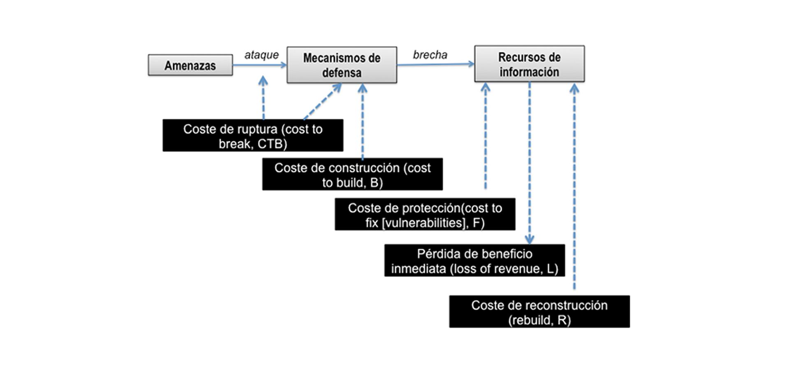
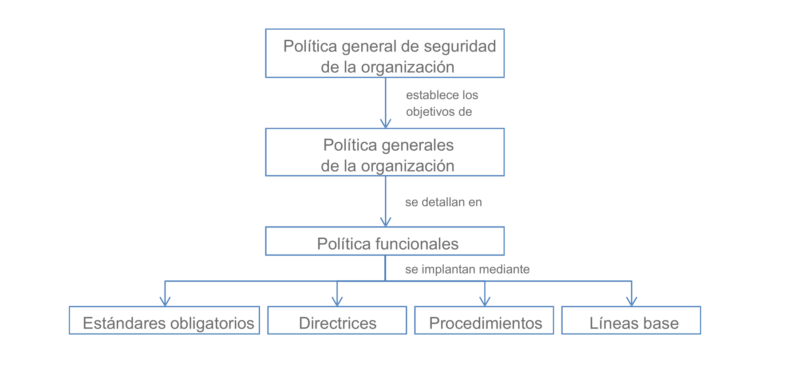

# Tema 1: La Seguridad de la información en las organizaciones

## 1. Objetivo

> Comprender la seguridad de la información como una actividad orientada a **garantizar la confidencialidad, integridad y disponibilidad** de los recursos valiosos de un **sistema de información**.

## 2. Introducción

- La **Seguridad** como proceso para:
    - Eliminar los **riesgos asociados** a:
        - **Confidencialidad**
        - **Integridad**
        - **Disponibilidad**
    - Del recurso más valioso: **la información**
    - ¿**Qué** se protege?:
        - *CID*
    - ¿**De qué** activos?:
        - Los activos *valiosos*
    - ¿**Por qué medios**?:
        - Controles implementados en:
            - Políticas
            - Estándares
            - Procedimientos

## 3. La seguridad de la información implica la confidencialidad, integridad y disponibilidad

- Tres perspectivas:
    - **Legal**
        - Las regulaciones (internacionales, nacionales y regionales) para proteger la privacidad y los derechos de PI
    - **Técnica**
        - Desarrollo, análisis, configuración de elementos técnicos relacionados con seguridad (HW, SW, redes)
    - **Organizativa**
        - Análisis de riesgos
- Importante:
    - La seguridad de la información es una **actividad crítica en la empresa** la seguridad es un **proceso continuo de mejora**
        - Hay que revisar periódicamente los controles y las medidas implementadas para asegurares de que mitiguen los riesgos y se adapten a los nuevos
    - **No existe un sistema perfectamente seguro**

### Confidencialidad

- Propiedad de **prevenir la revelación** y divulgación intencionada o no intencionada **de información a personas o sistemas no autorizados**

### Integridad

- Integridad es la propiedad que busca **mantener los datos libres de
modificaciones no autorizadas**
- Formas de gestionarla:
    - Dar acceso de acuerdo al criterio del menor privilegio (criterio **need-to-know**):
        - Solo se debe dar acceso a los usuarios a aquellos recursos de información que les sean absolutamente imprescindibles para realizar su trabajo
    - **Separación de obligaciones**:
        - Para una determinada tarea, no haya nunca un solo usuario responsable de realizarla
    - **Rotación de obligaciones**:
        - Propone que las tareas asignadas a
    los empleados cambien de responsable de vez en cuando

### Disponibilidad

- Disponibilidad propiedad de la información de **encontrarse a disposición de quienes deben acceder a ella** como usuarios autorizados, ya sean personas, procesos o aplicaciones.
- Dos situaciones típicas:
    - Ataques de **denegación de servicio** (Denial of Service, DoS)
    - **Pérdidas de datos o capacidades** de procesamiento de datos debidas a **catástrofes naturales**

### Otros conceptos

- **Sistemas de identificación**
    - Medios por los que los usuarios reclaman su identidad
        - Usuario/Contraseña
        - Tokens
        - Sistemas físicos
- **Autentificación**
    - Evaluación de la evidencia de la identidad de un usuario
- **Rendición de cuentas**
    - Capacidad de un sistema de atribuir cada acción realizada a un usuario
- **Autorización**
    - Derechos y permisos asignados a recursos o información
- **Privacidad**  
    - Nivel de confidencialidad que tiene un usuario

## 4. La seguridad es un asunto económico

- A veces **no se toma suficientemente en cuenta la seguridad de la información**
    - Hasta que experimentan un ataque o una brecha de seguridad
- **La seguridad cuesta dinero**
    - Buscar un equilibrio entre el coste de la seguridad y el impacto económico de los riesgos probables
- Es importante entender la **vertiente económica de la seguridad**
    - Los avances técnicos en seguridad no mejoran la seguridad de las empresas si no se ponen en prácticas

### Marco económico para la seguridad de la información

- Hay costes tanto desde el punto de vista del ataque, de la defensa, y de la mitigación del daño
- Principales costes de la organización
    - Costes de **medidas defensivas**
    - Costes de **reparación de vulnerabilidades**
    - Y también puede haber:
        - Costes post incidente

## 5. La seguridad es un proceso

- La seguridad es un proceso:
    - **Actividades continuas** dentro de
        - Un plan sistemático
            - Que debe **evaluarse continuamente**
    - Que implica:
        - La **identificación de activos de información**
        - Documentación en implementación de:
            - Políticas
            - Normas
            - Procedimientos
            - Directrices
        - Que garanticen **CID**
    - Usando:
        - Herramientas de gestión

## 6. La clasificación de la información

- La clasificación de la información permite **identificar el valor de los recursos de información**
    - Demuestra un **compromiso con la seguridad**
    - *Puede ser imprescindible* debido a regulaciones existentes

### Niveles de clasificación de la información

- General:
    - **Sin clasificar**
        - Información no sensible
        - No afecta a la confidencialidad
    - **Sensible** pero no clasificada
        - Impacto menor si se difunde
    - **Confidencial**
        - Puede causar daño si se difunde
    - **Secreta**
        - Su difusión causaría un daño importante
    - **Alto secreto**
        - Su difusión causaría un daño extremadamente grave
- Según el entorno empresarial
    - Uso publico
    - Uso interno
    - Confidencial

### Roles de clasificación de la información

- **Propietario**
    - Es el encargado de la protección de ese recurso
- **Responsable**
    - Normalmente es personal técnico, en quien el propietario delega la custodia efectiva de la información
- **Usuario**
    - "Consumidores" de la información para su trabajo diario

### Procedimientos de clasificación de la información

- **Identificar roles y criterios** de clasificación
- **Clasificar activos** de información por roles y niveles
    - Especificar y documentar cualquier excepción a la política de clasificación
- Especificar **controles** que se aplican a cada nivel de clasificación
- Especificar **procedimientos** para acceder o transferir esos activos de información
- Crear un programa de concienciación empresarial sobre la clasificación y los controles

## 7. La seguridad en la información implica la gestión de los riesgos

- El **Control de Seguridad**:
    - *Objetivo*: reducir los efectos de una amenaza o vulnerabilidad
- El establecimiento de un control de seguridad es consecuencia de:
    - Estudio previo del impacto: **análisis de riesgos**
    - Los conceptos de riesgo son la **vara de medir** para determinar si un control está bien implementado o no

### Ejemplo de control de seguridad

- Ejemplo:
    - Objetivo de control: *responsabilidades del usuario*
    - Control o medida de ejemplo: [A.9.3.1]
    - Uso de clave control: *Se debe requerir que los usuarios sigan buenas prácticas de seguridad en la selección y uso de claves*
- El riesgo en este caso redundaría en la pérdida de C/D/I
- La organización debe implementar este control en la forma de políticas y en procedimientos concretos

## 8. La seguridad se articula con controles de seguridad

- Para poder medir el impacto y la posibilidad de que un evento no deseado suceda
    - Hay que analizar el riesgo y sus elementos
- Una vez un riesgo ha sido analizado y evaluado se puede:

    1. **Aceptar** tal cual
    2. Tratar de tomar alguna **medida para mitigar su impacto o su probabilidad** de ocurrencia
    3. Evitarlo o **eliminarlo** completamente
    4. **Transferir** el riesgo (no actúa sobre el riesgo en sí)

## 9. La seguridad es tanto física como lógica

- La seguridad física es parte de la seguridad de la información
- Los controles de seguridad física son tan diversos como las amenazas
    - Controles administrativos:
        - Planificación de requisitos y gestión de la seguridad de las instalaciones
        - Controles administrativos al personal
        - ...
    - Controles del entorno y de la habitabilidad:
        - Suministro eléctrico
        - Detección y supresión de incendios
        - ...
    - Controles técnicos y físicos:
        - Inventario de equipos,
        - Alarmas
        - dispositivos de control de acceso a las instalaciones
        - ...

## 10. La seguridad implica a las persona

- El factor humano es un elemento más del sistema de información
    - Las políticas y las herramientas deben tenerlos en cuenta
- Ingeniería social
    - Métodos de obtener información confidencial a través de la manipulación de usuarios
- El **elemento más débil** del sistema de seguridad
    - El **factor humano**
