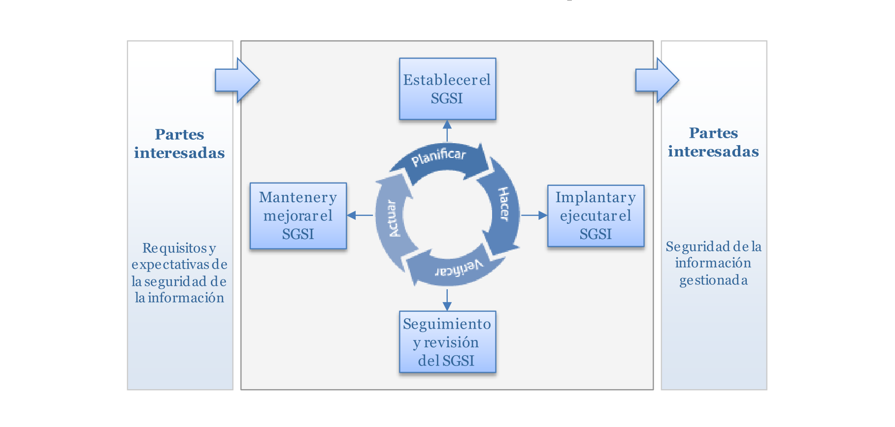
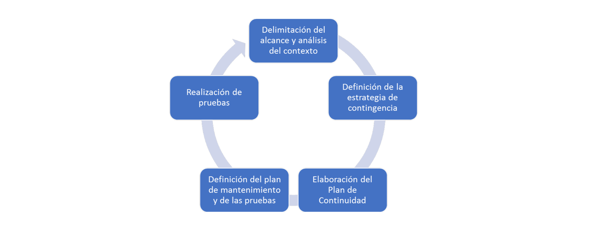

# Tema 2: Gobierno de la seguridad de la información

## 1. Introducción

- Conocer en qué consiste:
    - El **gobierno corporativo de la seguridad de la información**
        - Conceptos enfocados a la **estrategia de la seguridad** y cómo esta debe estar **alineada con los objetivos corporativos**
    - Los **principales estándares** (ISO38500, COBIT, ISO27001, ITIL)
        - En especial la norma **ISO 27001**
    - Conceptos necesarios para gestionar la protección de la información

## 2. Gobierno de la seguridad de la información

- En la seguridad de la información, el gobierno de la seguridad trata de:
    - Dar una **dirección estratégica** y **conseguir objetivos**:
        - Se debe alinear la seguridad de la información con la estrategia de negocio
        - Así mismo, se optimizarán las inversiones en la seguridad en apoyo a los objetivos del negocio
    - **Gestionar** adecuadamente los **riesgos**:
        - Identificar y valorar los riesgos
        - Implantar medidas adecuadas para mitigar los riesgos y reducir el impacto potencial a un nivel aceptable
    - Verificar que los **recursos** se utilicen con **responsabilidad**:
        - Utilizar el conocimiento y la infraestructura disponible de la mejor forma posible
        - Se deberá controlar y monitorizar la eficacia y la eficiencia de los controles ya implantados

### Visión

- Describe lo que la entidad desea que llegue a ser la seguridad de la información
    - Revision periódica
    - Guía para definir de la estrategia de seguridad

### Misión

- **Por qué** la seguridad de la información **es relevante en la organización**
    - Describe una realidad invariable en el tiempo
    - Puede lograrse de diversas formas
    - Sirve para tomar decisiones

### Estrategia de seguridad

- Describe cómo alcanzar las metas definidas
- Se revisa periódicamente debido a los permanentes cambios en el entorno
- *Contiene*:
    - De qué forma la seguridad **da valor** a la entidad
    - Cómo **reducir los riesgos**
        - Teniendo en cuenta normativas y costes
    - Cómo se protege la organización contra impactos de negocio

### Plan Director de Seguridad (PSD)

- Herramienta fundamental **para implantar la estrategia de seguridad** en una organización
- Periodo de 2 a 5
- *Permite*:
    - **Establecer directrices** de seguridad en consonancia con los objetivos corporativos
    - **Definir, planificar y formalizar** las actividades en seguridad
- *Determina:*
    - El **estado actual** de la seguridad de la información
    - El **resultado deseado** que se pretende alcanzar dentro de un periodo de tiempo
        - El resultado debe ser **alcanzable y medible**
    - El **plan de proyectos** que describa como se van a alcanzar dichos objetivos

#### Fases de un Plan Director de Seguridad

1. Definir modelo de seguridad
2. Análisis de la situación actual
3. Análisis GAP (donde se está y a donde se quiere llegar)
4. Definir plan de acción:
    - Proyectos y priorización
    - Aprobación y desarrollo del PDS
    - Seguimiento del plan y de los objetivos

### Criterios a tener en cuenta para un Plan Director de Seguridad

- Los objetivos y la estrategia corporativa
- La gestión de los riesgos:
    - Conocer los riesgos y cómo gestionarlos
- Las necesidades del negocio
- Estándares y buenas prácticas del sector
- Las circunstancias tecnológicas y operativas

## 3. El estándar ISO 27001

- UNE-ISO/IEC 27001:2013 **"Sistemas de Gestión de la Seguridad de la Información (SGSI). Requisitos"**
- Es el primero de la serie de estándares ISO 27000
    - ISO 27001: **Requerimientos** del SGSI
    - ISO 27002: **Buenas prácticas** en seguridad
    - ISO 27003: **Guía de implementación** del SGSI
    - ISO 27004: **Métricas** y mediciones del SGSI
    - ISO 27005: **Gestión del riesgo** en el SGSI
    - ISO 27006-27010: Numeración reservada a diferentes temas de la seguridad de la información
- Es la **norma principal** de la familia
    - Establece los **requisitos para la gestión del SGSI y su auditoría**
- Es un código aceptado internacionalmente en la práctica de la seguridad de la información
- Método de **cuatro fases** para implementar un SGSI
- Es la **base del proceso de auditoría y certificación** de los sistemas de seguridad de información de las organizaciones

### Estructura de la norma y contenidos

| **Cápitulo** | **Título**                  | **Contenidos**                                                                                                          |
|--------------|-----------------------------|-------------------------------------------------------------------------------------------------------------------------|
| **1**        | Alcance                     | Establece el alcance y ámbito de aplicación de la norma                                                                 |
| **2**        | Referencias                 | Detalla otras normas relacionadas                                                                                       |
| **3**        | Términos y definiciones     | Proporciona las definiciones de la terminología básica                                                                  |
| **4**        | Contexto de la organización | Identifica los aspectos relevantes de la organización de cara a la seguridad de la información y se delimita el alcance |
| **5**        | Liderazgo                   | Establece los requisitos de compromiso de la dirección y de asignación de recursos                                      |
| **6**        | Planificación               | Descripción de los objetivos de seguridad y definición de la gestión de los riesgos                                     |
| **7**        | Soporte                     | Dotación de recursos para el establecimiento y mejora del SGSI.                                                         |
| **8**        | Operación                   | Verificación de la operación del SGSIy del estado de los riesgos                                                        |
| **9**        | Evaluación del desempeño    | Realización de auditorías internas y revisiones del SGSI                                                                |
| **10**       | Mejora                      | Gestión de las no conformidades, las acciones correctivas y la mejora continua                                          |

### Proceso de un SGSI

### Requisitos generales de la norma ISO 27001

#### Requisitos de documentación

- Documentar la **política, alcance y objetivos del SGSI**
- Documentar **procedimientos y controles** del SGSI
- La dirección debe aprobar un **documento de política de seguridad de la información**
    - Para los empleados
- La documentación se ha de revisar y actualizar según las necesidades

#### Compromiso de la dirección

- En el **proceso de comunicación interna**
- En el **establecimiento de la política y los objetivos** del sistema de gestión de seguridad de la información de la empresa
- En la **revisión periódica del desempeño** del SGSI
- En el aseguramiento de **la disponibilidad de los recursos necesarios** para la plena efectividad del sistema

#### Responsabilidades

- Deben estar **perfectamente definidas**
- La Norma ISO requiere que **la alta dirección asegure que se cumplan estos  requisitos** y que las responsabilidades sean comunicadas dentro de la organización
- Se puede nombrar un representante de la dirección que tendrá la responsabilidad de:
    - Asegurar que los procesos del sistema de gestión de seguridad de la información **se implanten y funcionen**
    - Informar a la alta dirección sobre el **desempeño del sistema** y de cualquier **oportunidad de mejora**

## 4. Gestión de servicios de TI

- Servicio de TI → uso de tecnologías de la información para:
    - **Apoyo al cliente** en sus tareas
    - Tres componentes claves:
        - **Personas**
        - **Procesos**
        - **Tecnología**
    - Acuerdos de Nivel de Servicio (*Service Level Agreement*, **SLA**)

### Buenas prácticas en los servicios de TI: **ITIL**

- **Infrastructure Library (ITIL)**:
    - Primera versión de la IT que consistía en un conjunto de libros documentando los hallazgos de los estudios mencionados
- **Information Technology Service Management Forum (itSMF)**:
    - Único grupo de usuarios internacionalmente reconocido e independiente dedicado a la gestión de servicios TI
- **The Office of Government Commerce (OGC)**:
    - Oficina independiente del Tesoro en el Reino Unido
- **APMG, o el Grupo APM Group**:
    - Contratados por la OGC para ser el proveedor acreditado en los siguientes años

#### Principios fundamentales ITIL

- **No es propietario**
- **No es prescriptivo**
    - No obliga a ninguna técnica o tecnología concreta
- Consiste en las **mejores prácticas**
    - Resultado de la experiencia global acumulada
- Consiste en buenas prácticas
    - Pero pueden aparecen nuevas prácticas mejores

#### Características de las prácticas ITIL

- Son **predictivos** en lugar de reactivos
    - Estudiar el uso de los clientes o usuarios
- Son **consistentes y medibles**
- Son **adaptables**
    - Optimización y mejora continua

#### Proceso de gestión de la seguridad en ITIL

| **Subproceso**                         | **Objetivo**                                                                                                                                                                         |
|----------------------------------------|--------------------------------------------------------------------------------------------------------------------------------------------------------------------------------------|
| **Diseño de controles de seguridad**   | Diseñar las medidas técnicas y organizativas necesarias para asegurar la CID de los activos                                                                                          |
| **Pruebas de seguridad**               | Asegurar que los mecanismos de seguridad están sujetos a pruebas regulares                                                                                                           |
| **Gestión de incidentes de seguridad** | Detectar y combatir los ataques y las intrusiones, y minimizar el daño de las brechas de seguridad                                                                                   |
| **Revisión de la seguridad**           | Revisar si las medidas y procedimientos de seguridad son coherentes con las percepciones de riesgo del negocio, y si esas medidas y procedimientos se revisan y evalúan regularmente |

#### Indicadores

| **KPI**                                                                  | **Descripción**                                                                                                 |
|--------------------------------------------------------------------------|-----------------------------------------------------------------------------------------------------------------|
| **Número de medidas de prevención implementadas**                        | Número de medidas de prevención implementadas en respuesta a amenazas a la seguridad implementadas              |
| **Duración de la implementación**                                        | Tiempo transcurrido desde la identificación de una amenaza hasta la implementación de una contramedida adecuada |
| **Número de incidentes de seguridad importantes**                        | Número de incidentes, clasificados por severidad                                                                |
| **Número de caídas del nivel de servicio relacionadas con la seguridad** | Número de incidentes que han causado no disponibilidad del servicio limitada o interrupción                     |
| **Número de test de seguridad**                                          | Número de test de seguridad (y de procesos de formación) llevados a cabo                                        |
| **Número de problemas identificados durante los test**                   | Número de problemas identificados en el transcurso de los test de seguridad                                     |

## 5. El estándar ISO 22301

- Origen en la norma Británica BS 25999
- Destinada a **responder y proteger ante contingencias**
- Comprende situaciones críticas como:
    - Desastres meteorológicos
    - Huelgas
    - Cortes prolongados de suministros
    - Enfermedades con gran alcance
    - Atentados terroristas
    - ...

### Objetivos

- **Identificar y gestionar las amenazas** para los procesos críticos
- **Incrementar la resiliencia** de forma proactiva
    - De cara a poder sobreponerse a una eventual crisis
- **Recuperar los procesos críticos** cuanto antes en caso de desastre
- **Aumentar la confianza** ante clientes y proveedores
    - Usando las mejores prácticas en continuidad de negocio

### Requisitos

- Requisitos para:
    - Planificación
    - Implantación
    - Operación
    - Supervisión
    - Mantenimiento
    - Mejora continua
- Son genéricos
- Orientados a **garantizar la continuidad**
- Aplicables a **todo tipo de organizaciones**

### Plan de continuidad del negocio

1. Delimitación del **alcance y análisis de contexto**
    - Se identifican procesos críticos
    - Análisis del Impacto de Negocio (BIA)
    - Análisis de riesgos
2. Definición de la **estrategia de contingencia**
    - Categorizar activos
    - Respuesta ante indisponibilidad
    - Continuidad de los procesos críticos
3. Elaboración del **plan de continuidad**
    - Plan de Crisis
        - Cómo reaccionar y qué acciones tomar
    - Plan de Recuperación ante Desastres
        - Restauración de la infraestructura
    - Detalle de procedimientos y guías
4. Definición del **plan de mantenimiento** y de las pruebas
    - Definición de mejoras continuas
    - Definición de pruebas
5. Realización de las **pruebas**
    - Verificar la eficacia y eficiencia

## 6. Modelos de madurez para la seguridad de la información

- Sirve para situar y **evaluar el grado de desarrollo de una gestión** sistemática, predecible y optimizable

### El modelo de madurez CMMI

- *Capability Madurity Model Integration*
- Es el modelo de madurez **más conocido y extendido**
- Es una **guía que describe las características que hacen efectivo a un proceso**
- Mejora de los procedimientos y procesos que las personas de una organización llevan a cabo con ayuda de tecnología y otras herramientas

### Modelo de madurez O-ISM3

- *Open Group Security Management Maturity Model*
- Permite el diseño de **SGSI alineados con la misión** de la organización empresarial
- Permite a las organizaciones **priorizar y optimizar las inversiones** en seguridad de la información
- El modelo se basa en:
    - Gestión de riesgos
    - Controles de seguridad
    - Gestión de la seguridad
- El estándar se basa en:
- **Proceso**
    - Los procesos tienen capacidades que se realizan mediante prácticas de gestión
- **Capacidad**
    - Las métricas de un proceso revelan las capacidades del mismo
- Grado de **madurez**
