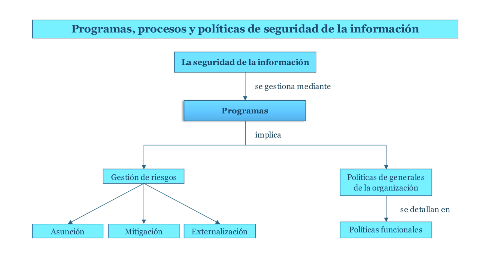

# Tema 3: Programas, procesos y políticas de seguridad de la información

## 1. Introducción

La gestión de riesgos es una actividad central que se debe contextualizar en las opciones de mitigación del riesgo, con diferentes modelos económicos.

## 2. Programas de gestión de la seguridad

- **Conjunto de actividades planificadas** dentro de una organización para garantizar la CID de los recursos de información
- Deben ser **comunicados de forma entendible** a todos los empleados
- Un programa no es una acción concreta
    - Sino un **área de gestión** orientada a la **mejora continua**
- Los programas de gestión de la seguridad comienzan por un proceso fundamental:
    - **La gestión de riesgos**
        - Que establece los objetivos de la gestión analizando las amenazas y su potencial impacto
        - Con los riesgos analizados se eligen los controles a implementar
- Son importantes los programas de concienciación (o educación) de los empleados
    - Para hacer efectiva la implementación de políticas, estándares y procedimientos

### Políticas, estándares, líneas base y procedimientos

- **Políticas**: Establecen las directrices generales
- **Estándares**: Establecen las herramientas requeridas
- **Líneas base**: Establecen los parámetros que se utilizarán
- **Procedimientos**: Establecen las guías paso a paso que se deben realizar diariamente

## 3. La gestión de riesgos

- Riesgo: posibilidad de ocurrencia de un evento no deseado
- Gestión del riesgo:
    - Conjunto de procesos:
        - Para → identificar, analizar y evaluar los riesgos
        - Para → tomar las decisiones sobre su asunción, mitigación o transferencia
    - Deben ser estudiados y analizados, para poder tomar decisiones
    - Las decisiones pueden ser:
        1. **Aceptar** tal cual
        2. Tratar de tomar alguna **medida para mitigar su impacto o su probabilidad** de ocurrencia
        3. **Transferir** el riesgo
        4. Evitarlo o **eliminarlo** completamente

### Preguntas sobre la Gestión de Riesgos

- ¿**Qué podría suceder**?
    - Eventos indeseados o amenazas
- ¿**cuán malo puede ser**? (si se da el evento)
    - Impacto de la amenaza
- ¿Con qué **frecuencia** puede ocurrir?
- ¿**Cuán seguros estamos** de las respuestas a las tres primeras preguntas?
    - reconocimiento de nuestra incertidumbre

### Preguntas una vez que los riesgos han sido analizados y evaluados

- ¿**Qué** se puede **hacer**?
    - Mitigación de riesgos
- ¿**Cuánto** va a **costar**?
    - Por intervalos de tiempo
- ¿**Es rentable**?
    - Análisis coste/beneficio

### Definiciones de conceptos relacionados con la gestión del riesgo

- Basada en estándares como ISO 17799
- Algunas definiciones previas importantes son las siguientes:
    - **Amenaza** (threat): un peligro potencial a un recurso
    - **Fuente/agente de la amenaza** (threat-source/agent): algo o alguien que tiene capacidad potencial para materializar la amenaza
    - **Vulnerabilidad**: una debilidad o fallo en un recurso
    - **Exposición**: una oportunidad para que una amenaza cause un daño

### Controles (Gestión de Riesgos)

- **Mecanismos de mitigación**:
    - Técnicos (*un firewall*)
    - No técnicos
        - Administrativos (*políticas y procedimientos*)
        - Físicos (*alarmas, cerraduras o detectores de fuego*)
- **Salvaguardas** (safeguard): controles preventivos y proactivos
- **Contramedidas**: controles correctivos (reactivos)

### Procesos (Gestión de Riesgos)

- **Evaluación** del riesgo (risk assessment). A su vez, se considera dentro de esta fase otras, como:
    - Análisis de riesgos:
        - Cuantitativa (estimando el valor monetario de la ocurrencia de las amenazas
        - Cualitativa (basada en escenarios)
- **Implementación** de controles
- **Evaluación continua** de los controles

### Análisis de riesgos cuantitativo

- Valoración económica de los recursos

| Concepto                                                          | Formulación                                                         |
|-------------------------------------------------------------------|---------------------------------------------------------------------|
| Factor de exposición (exposure factor, FE)                        | Porcentaje de pérdida de valor de un recurso asociado a una amenaza |
| Expectativa de pérdida (single loss expectancy, SLE)              | Valor del recurso multiplicado por FE                               |
| Tasa de ocurrencia anualizada (annualized rate of occurency, ARO) | Frecuencia de la ocurrencia de la amenaza anual                     |
| Expectativa de pérdida anual (annualized loss expectancy, ALO)    | SLE*ARO                                                             |

#### Desventajas del análisis de riesgos cuantitativo

- Dificultad de **medir el valor de los recursos**
    - **Coste inicial y continuo**
    - **Valor del recurso**
    - **Valor de mercado del recurso**

## 4. Diseño de políticas de seguridad

### Tipos de Políticas

- "Política" puede significar varias cosas
- En este caso, se entiende como políticas **los controles administrativos de carácter temático**:
    - **Políticas funcionales**

### Políticas y su importancia

- **Plan de alto nivel**
    - Describe los objetivos de los procedimientos.
- **No son** directrices o estándares
    - Ni tampoco obviamente procedimientos
- Describen la seguridad en **términos generales** y no específicos
- Pueden considerarse las "plantillas" o "**requisitos generales**"
    - Determinan cómo se diseñarán e implementarán los diferentes elementos de la seguridad

### Utilidades

- Un **salvavidas** durante un desastre
- Un **requisito** de una función reguladora
- Proporcionar **protección contra la responsabilidad** debida a un trabajador
- Definir **acciones para el control** de los secretos comerciales

### Diseño de políticas

- **Definen los objetivos de la seguridad**
- La **participación de la dirección** en la definición de las políticas muestra  implicación y compromiso de la organización en sus niveles directivos
- Las políticas se aplican a la organización entera.
- Facilitan tener unos **estándares de seguridad coherentes**
    - Los clientes pueden apreciarlo
- Son útiles para gestionar los litigios
