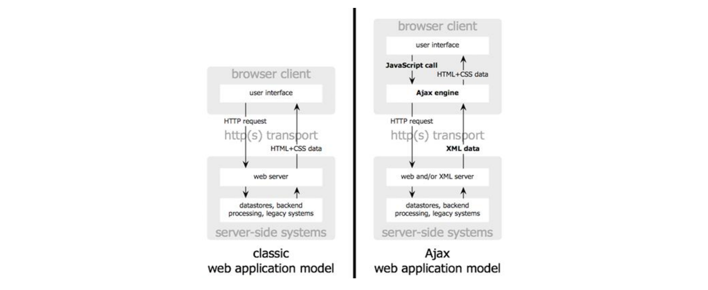

# Tema 1: Aplicaciones, servicios web y bases de datos

## 1. Introducción

### Pilares de seguridad

- **Política de seguridad**
    - **Bien definida, implantada, gestionada por procesos**
    - ¿Quién?
        - Alta dirección 🠒 Implantarla
        - Todos 🠒 cumplirla
    - Ejemplos:
        - Normas clave, de equipos, de acceso remoto, seguridad perimetral, respuesta a incidentes, etc.
- **SGSI** (ISO 27001, ENS, …)
    - Conjunto de prácticas orientadas a garantizar la CID de los activos de información de una organización
    - Ciclo PDCA
- **Ciclo de Vida de Desarrollo Seguro de Software** (SSDLC)
- **Monitorización continua** 🠒 análisis y gestión dinámica del riesgo

## 2. Ciclo de vida de desarrollo seguro de software (SSDLC)

- Aplicar las políticas de seguridad al desarrollo del software
- Ciclo continuo
- **Actividades**:
    - Requisitos de seguridad y casos de abuso
    - Análisis de riesgo
    - Análisis de seguridad del código fuente
    - Pruebas funcionales de seguridad
    - Configuraciones de seguridad y pruebas de penetración
    - Operaciones de Seguridad (fase producción)
- Según el tipo de actividad se realiza en unas u otras fases del ciclo de desarrollo
- *Ejemplos*: BSIMM, Open SAM (Owasp), Clasp, SDL (Microsoft), Cisco SDL, Common Criteria (1-7)

## 3. Vulnerabilidades de seguridad en las aplicaciones web

- Pueden darse vulnerabilidades en:
    - **Diseño**: problemas funcionales de diseño en la autenticación, el control de accesos, ...
    - **Implementaciones**: vulnerabilidades de seguridad en el código
    - **Operación**: fallos de configuración, mala gestión de la seguridad
- Ataque: acto malévolo previsto contra un sistema o un conjunto de sistemas (se valen de vulnerabilidades)

### OWASP Top 10 (2017)

1. **Injection** (SQL, NoSQL, OS, LDAP, ...)
2. **Broken Authentication**
3. **Sensitive Data Exposure**
4. **XEE** (*XML External Entities*)
5. **Broken Access Control**
6. **Security Misconfiguration**
7. **XSS** (*Cross-Site Scripting*)
8. **Insecure Deserialization**
9. **Using Components with Known Vulnerabilities**
10. **Insufficient Logging** & Monitoring

## 4. Arquitecturas y tecnologías de desarrollo de las aplicaciones web

-*Clasificación de aplicaciones*:
    - No Web
        - Cliente – Servidor
        - SOA (Java, RMI, Corba, ...)
        - Embebidas
    - Web/Servicios Web
        - Tradicionales/monolito
        - RIA (Rich Internet Applications) (AJAX, HTML5, ...)
        - Web Services (SOA)
    - Móviles
        - Nativas
        - Web apps
        - Híbridas (RIA)

### Evolución de las tecnologías de desarrollo web

- La evolución de las aplicaciones web se puede distinguir a grandes rasgos en diferentes fases:
    1. Webs estáticas (HTML y HTTP)
    2. Common Gateway Interface (CGI)
        - Las aplicaciones web originalmente eran estáticas
        - Primer paso hacia webs dinámicas
        - Interfaces desarrolladas en C/C++
        - Poco seguras, difíciles de mantener y pocos flexibles
    3. Lenguajes de Scripts
        - Mucho mas flexibles para la programación de webs, tanto en
            - Cliente: Javascript
            - Servidor: ASP, Perl, PHP, ...
    4. Especificaciones y marcos de desarrollo de aplicaciones web
        - Entornos y frameworks completos de desarrollo como .NET o J2EE
            - Permiten crear aplicaciones mucho mas complejas, mantenibles y escalables

### HTTP

- Protocolo a nivel de aplicación
- Protocolo **sin estado**
    - Mecanismos a parte para gestión de sesiones
- No fue pensado originalmente para usos seguros
- *Versiones*
    - HTTP/1.0 (1996)
    - HTTP/1.1 (1999)
    - HTTP/1.2 (2000)
    - HTTP/2 (2015)
    - HTTP/3 (2018)
- *Métodos* (HTTP 1.1):
    - **HEAD**
        - Petición para pedir solo cabeceras
    - **GET**
        - Pide un recurso especificado
        - Transmite los parámetros en la URL
        - **Ejemplo**: `GET /ejemplo.html?var1=valor1&var2=valor2 HTTP/1.1`
    - **POST**
        - Envía datos para que sean procesados por un recurso
        - Los datos van en el cuerpo de la petición
    - **PUT**
        - Sube, carga o realiza un upload de un recurso especificado
    - **DELETE**
        - Borra el recurso especificado
    - **TRACE**
        - Solicita una respuesta (con fines de diagnóstico)
    - **OPTIONS**
        - Devuelve los métodos HTTP que el servidor soporta para un URL específico
    - **CONNECT**
        - Se utiliza para saber si se tiene acceso a un host
- Estructura petición HTTP:

- **Vulnerabilidades HTTP**:
    - **XST** (*Cross Site Tracing*)
        - Usar TRACE para obtener la cookie de sesión
        - Con ``HttpOnly` no se puede acceder a las cookies desde el script, pero:
            - Se usa XSS para inyectar una llamada a TRACE y ver la respuesta (que viene con la cookie a la que no se podía acceder)
        - *Mitigación*: Desactivar TRACE
    - Procedencia peticiones
    - **HTTP response splitting**
        - Consiste en inyectar una petición HTTP maligna en un servidor para que sea devuelta a usuarios
        - Vector de ataque para otros ataques (XSS, ...)
        - *Mitigación*: validación de entrada y salida (ojo con `\r\n`)
    - **Clickjacking**
        - Consiste en inyectar frames o contenido oculto encima de contenido para que se clique
        - *Mitigación*: `X-Frame-Options` con `ALLOW-FROM origin` para impedir framing desde otros sitios
        - **Same Origin Policy**

### Arquitecturas y patrones de diseño de aplicaciones web

- **Originalmente** se empleaban **arquitecturas monolíticas**
- **Actualmente** la opción mas usada es **frameworks completos** que permiten flexibilidad y escalabilidad
- *Capas* de una aplicación web:
    - Clientes Web (navegador)
    - Capa de **presentación/aplicación** (lógica de negocio)
        - Servidores web
            - *Ejemplos*: Apache, IIS, ...
        - Servidor de aplicaciones web
            - *Ejemplos*: Weblogic, Tomcat, WebSphere, Struts, .NET, ColdFusion, ...
    - Capa de **persistencia** (base de datos)
        - *Ejemplos*: Oracle, MS SQL Server, MySQL, PostgreSQL, ...
- Para separar el desarrollo en diferentes capas se emplea **patrones de diseño como MVC**

### Modelo-Vista-Controlador (MVC)

- Patrón de diseño que permite separar responsabilidades
- Permite obtener una aplicación con mayor facilidad para mantener y escalar
- **Vista**
    - Capa que se ocupa de **generar la presentación** al usuario
    - Paginas HTML generadas en base a plantillas
- ***Controlador***
    - **Recoge las peticiones** para ejecutar el código de aplicación o lógica de negocio encargado de servir las peticiones  
        - Validación de entradas de datos
        - Validación de salidas
- **Modelo**
    - Capa de la aplicación que se ocupa de los **datos** que necesita la aplicación y los **accesos** a los datos

### Arquitectura Clásica vs RIA

- **AJAX** (*Asynchronous JavaScript And XML*):
    - Tecnología que permite ejecutar javascript asíncrono
    - Esto permite que la web no tenga que "recargarse" (usuario enviar una petición de nuevo) para actualizarse
        - Permite aplicaciones mucho **más dinámicas**
    - El intercambio de datos se puede hacer tanto con XML como con otros formatos como JSON
    - Tiene también consideraciones de *seguridad*:
        - **Aumento de la superficie**
        - **Exposición** de la lógica y funciones de la aplicación
        - Violación de la política del mismo origen
        - **Mayor dificultad en la auditoría** de aplicaciones
            - Hay que revisar el código del cliente a fondo
    - *Consejos*
        - **TLS** para transmitir datos
        - **Controlar el navegador**
        - **Cuidado con ataques XSS**
        - **Minimizar lógica e información** en el cliente
