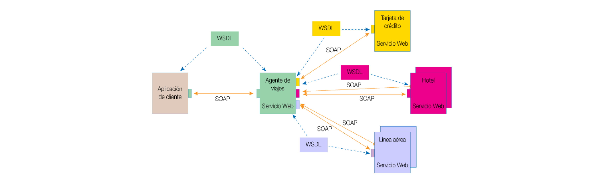
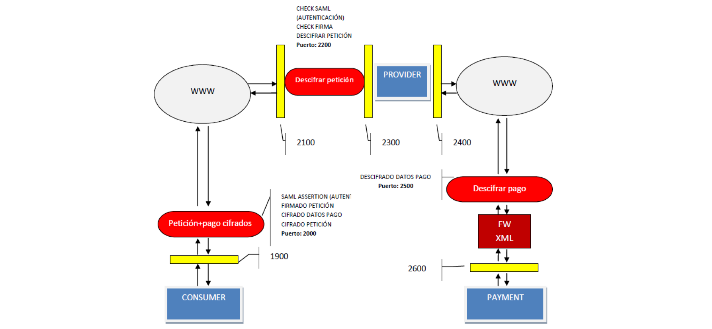

# Tema 3: Seguridad de los servicios web

## 1. Introducción a la seguridad de los servicios web

> Servicio web: conjunto de aplicaciones o de tecnologías con capacidad para interoperar en la web

- Los servicios web se originan para **SOA** (*Service-Oriented Architecture*)
    - Ejemplos de esta arquitectura: RPC, RMI, CORBA
- Proporcionan información dinámica
- Permiten operar entre ellos y extenderse a mas servicios

### SOAP (Simple Object Access Protocol)

- Para comunicarse con y entre servicios web es necesario que se entiendan entre ellos:
    - **SOAP**
        - Estructura **XML** con formato: `Envelope{Header (HeaderBlock[]) Body(BodyBlock[])}`

```xml
<env:Envelope xmlns:env="http://www.w3.org/2003/05/soap-envelope"> 
  <env:Header>
    <m:reserva xmlns:m="[[http://www.example.org]]" 
               env:role="http://www.w3.org/2003/05/soap-envelope/role/next"
               env:mustUnderstand="true">
      <m:referencia>uuid:093a2da1-q345-739r-ba5d-pqff98fe8j7d</m:referencia>
      <m:fechaYHora>2001-11-29T13:20:00.000-05:00</m:fechaYHora>
    </m:reserva>
    <n:pasajero xmlns:n="http://miempresa.example.com/empleados"
                env:role="http://www.w3.org/2003/05/soap-envelope/role/next"
                env:mustUnderstand="true">
      <n:nombre>Åke Jógvan Øyvind</n:nombre>
    </n:pasajero >
  </env:Header>
  <env:Body>
    <p:itinerario xmlns:p="http://empresaviajes.example.org/reserva/viaje">
      <p:ida>
        <p:salida>Nueva York</p:salida>
        <p:llegada>Los Angeles</p:llegada>
        <p:fechaSalida>2001-12-14</p:fechaSalida>
        <p:horaSalida>última hora de la tarde</p:horaSalida>
        <p:preferenciaAsiento>pasillo</p:preferenciaAsiento>
      </p:ida>
      <p:vuelta>
        <p:salida>Los Angeles</p:salida>
        <p:llegada>Nueva York</p:llegada>
        <p:fechaSalida>2001-12-20</p:fechaSalida>
        <p:horaSalida>media-mañana</p:horaSalida>
        <p:preferenciaAsiento />
      </p:vuelta>
    </p:itinerario>
    <q:alojamiento xmlns:q="http://empresaviajes.example.org/reserva/hoteles">
      <q:preferencia>ninguna</q:preferencia>
    </q:alojamiento>
  </env:Body>
</env:Envelope>
```

### WSDL (Web Service Description Language)

- Es el **estándar** para **describir un servicio Web**
- En **XML**
- *Describe*:
    - Las **funciones** públicas accesibles
    - Los **formatos de los mensajes** de petición y respuesta
    - El **protocolo** que utilizar para la comunicación (HTTP)
    - Información para **localizar** un servicio especifico

```xml
<message name "getTermRequest">
    <part name="term" "type xs:string"/>
</message>
<message name "getTermResponse"
    <part name="value" type="xs:string"/>
</message>
<portType name="glossaryTerms">
    <operation name="getTerm">
        <input message="getTermRequest"/>
        <output message="getTermResponse"/>
    </operation>
</portType>
<binding type="glossaryTerms" name ="b1">
    <soap:binding style="document" transport ="http://schemas.xmlsoap.org/soap/http"/>
    <operation>
        <soap:operation soapAction ="http://example.com/getTerm"/>
        <input><soap:body use="literal"/></input>
        <output><soap:body use="literal"/></output>
    </operation>
</binding>
```

### UDDI (Universal Description, Discovery and Integration)

- Proporciona un **registro** por medio del cual los Web Services pueden **anunciarse y encontrar otros Web Services**
- Tres componentes:
    - *Sección Blanca*: dirección, contacto, otros identificadores
    - *Sección Amarilla*: categorías de catalogación industrial
    - *Sección Verde*: información sobre los servicios ofrecidos

### Proceso de búsqueda de un Servicio Web

1. El **proveedor** del servicio **publica** el servicio usando un operación de **registro UDDI**
2. El **consumidor** de servicio **solicita el archivo WSDL** para conocer ubicación, funciones, y cómo acceder al Web Service 🠒 **Consulta UDDI**
3. El consumidor construye una petición SOAP y la envía hacia el
proveedor de servicio vía HTTP, SMTP…

### Ejemplo de arquitectura WS



### Seugiridad en servicios web

- Los servicios web son susceptibles de muchas amenazas y riesgos:
    - Alteración de mensajes, MITM, Spoofing, DoS, falta de confidencialidad, ...
- Los servicios web son vulnerables a muchas de las vulnerabilidades de las aplicaciones web:
    - SQLI, XSS, Path traversal, Command Injection, ....
- Pero hay una serie de **vulnerabilidades especificas** para estos servicios y sus tecnologías
    - **XML Injection**
    - **Xquery Injection**
    - **Xpath Injection**
    - **XML External Entities**
        - LFI/RFI poniendo rutas a archivos en el mensaje
            - `.. <!DOCTYPE root [ <!ENTITY foo SYSTEM "file:///c:/winnt/win.ini "> ]> ...`
    - **Soap Array Abuse (DOS)**
        - Definir arrays muy grandes en el body -> DoS
    - **XML Attribute Blowup**
        - Muchos atributos en un mismo XML -> para guardarlo en la BD... -> DoS
- *Problemas*:
    - El distribuir la funcionalidad en servicios hace que la **infraestructura de seguridad esté muy distribuida**
        - La **seguridad total** es la seguridad de la **parte más débil**
    - El WSDL da información al atacante, ya que es público
    - Asegurar la **disponibilidad** es más difícil
    - Dependencias

## 2. Especificaciones de seguridad para los servicios web

- Política de seguridad
- Confidencialidad e integridad
- Sistemas de gestión de identidades: autenticación, autorización
- Monitorización
- Disponibilidad
- Seguridad en el servicio de descubrimiento

### Política de seguridad

- __**WS-Policy**__
    - Capacidades, requisitos y **características generales de seguridad** de las entidades de un sistema de Web Services basados en XML
    - Base para otras especificaciones
        - WS-Security-Policy (oasis)
        - WS-Reliable-Messaging (oasis)
        - WS Addressing (w3c)
        - WS SecureConversation (oasis)
- __**WS-Security-Policy**__
    - Es una extensión de WS-Policy
    - Requisitos para cómo se deben asegurar los mensajes y qué tokens son requeridos por el servicio
    - Utiliza WS-Trust para determinar que tokens son necesarios para un WS particular
- __**WS-Trust**__
    - Define como adquirir tokens de seguridad
        - SAML assertions
        - Tickets kerberos
        - X.509
        - Usuario/contraseña
- __**WS-Federation**__
    - Forma para que **un proveedor** pueda **autorizar** acceso **en base a los datos de otros proveedores**
- __**P3P (Platform for Privacy Preferences)**__

### Confidencialidad e integridad

- __**WS-Security**__
    - Describe la **forma de asegurar** los servicios web **en el nivel de los mensajes**
- __**WS-SecureConversation**__
    - Define como usar XML encryption y XML signature para asegurar los mensajes SOAP
    - __**XML Digital Signature**__
        - Creación y manejo de firmas digitales basadas en el lenguaje XML
    - __**XML Encryption**__
        - Cifrado parcial o total de mensajes
- __**XKMS**__
    - Obtención de información acerca de claves y certificados
- __**WS-Addressing**__
    - Ofrece **seguridad de extremo a extremo** a la mensajería SOAP
    - Convierte los mensajes en unidades autónomas de comunicación
    - Nuevos elementos:
        - *Endpoint references (EPR)*: a donde deben ser dirigidas
        - *Message information headers*: información sobre la identificación del mensaje
- __**XML Advanced Electronic Signatures (XAdES)**__
    - Permite mecanismos de **firma**
        - Soporte para firma electrónica avanzada
        - Timestamps
        - Diferentes documentos, formatos, ...

### Sistemas de gestión de identidades: autenticación, autorización

- __**SAML**__ (*Security Authorization Markup Language*)
    - Protocolo que permite implementar los servicios de **autenticación y autorización** en SW
        - **Declaración**:
            - *Authentication*: informa sobre la autenticación de un sujeto particular
            - *Attributes*: cualifican al sujeto para decisiones de autorización
            - *Authorization*: permite o deniega a un sujeto el acceso a un recurso específico
        - **Afirmación**:
            - Compuesta de una o varias declaraciones
                - Pueden informar acerca de la autenticación
                - Sobre un atributo
                - Sobre decisiones de autorización
- __**XACML**__ (*eXtensible Access Control Markup Language*)
    - EStandar bajo XML para crear un lenguaje para definir la **autorización**
    - Permite flexibilidad para definir las politicas de autorización
    - *Dos esquemas*:
        - **Esquema** para **mensajes de autorización**
        - **Esquema** para **políticas de acceso**
    - *Ventajas*:
        - Lenguaje unificado
        - Fácil migración y escalabilidad
- *Modelos de autorización*:
    - **RBAC** (*Role-Based Access Control*)
        - Asocia un conjunto de privilegios de acceso con una función particular
    - **ABAC** (*Attribute-Based Access Control*)
        - Definir un sujeto en base a atributos de:
            - Tema
            - Recursos
            - Entorno
    - **PBAC** (*Policy-Based Access Control*)
        - Extensión lógica y algo acotado de ABAC que es útil para la aplicación de políticas de control de acceso estrictas
    - **RAdAC** (*Risk Adaptive Access Control*)
        - Toma decisiones de autorización en base a un perfil de riesgo relativo al sujeto

### Disponibilidad

- __**WS-ReliableMessaging**__
    - Protocolo para garantizar el envío de mensajes extremo a extremo
    - Opciones para configurar los intentos
        - *AtLeastOnce*
        - *AtMostOnce*
        - *ExactlyOnce*
        - *InOrder*

## 3. Evaluación de la seguridad de los servicios web

- Para evaluar la seguridad de los WS el proceso es el mismo que el que se desarrollaría en un SSDLC, con la particularidad de herramientas a utilizar
    - Herramientas para aplicaciones web más específicas como:
        - Soapsonar, SoapUI, wsScanner, wsFuzzer, ...
- Los aspectos más importante a tener en cuenta en un SSDLC son:
    1. **Modelado** de amenazas y casos de abuso
    2. Análisis de los **requisitos** de seguridad
    3. Análisis de **riesgos** de la arquitectura
    4. **Pruebas** funcionales de seguridad
        - **Tener en cuenta**:
            - Generación y **comprobación de mensajes de SOAP y XML**
            - Generación automática de planes de **pruebas a partir de archivos WSDL**
            - **Simulación** de las acciones de los **proveedores y clientes**
    5. **Revisión del código**
    6. **Pentesting**
    7. Operaciones de seguridad online
        - Existen tanto firewalls a nivel de aplicación y **firewalls XML** específicos para servidores
    8. Evaluación externa independiente

## 4. Protección online. Firewalls y Gateways XML

- SOAP se soporta a traves de HTTP
    - Las protecciones para HTTP son también validas
*Gateways XML*:
    - Servicio de autenticacion, autorización, confidencialidad, ... más **firewall XML**



- **Ataques que pueden mitigar** los firewall XML:
    - Escaneo WSDL
    - Manipulación de parámetros
    - Ataques de repetición
    - Ataques recursivos con payloads
    - Ataques de referencia externa
    - Envenenamiento de esquema
    - SQL inyección
    - Buffer overflow
    - XSS
