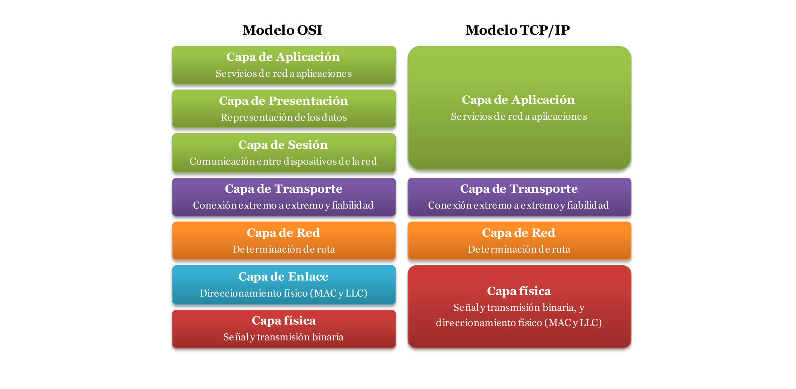

# Tema 3: Mecanismos de defensa en redes

## 1.1. Introducción

- TCP/IP
    - Diseño con 50 años de antigüedad (1974)
    - Problemas:
        - Incremento exponencial de ordenadores
        - Incremento exponencial de usuarios
        - Transmisión de información sensible

## 1.2. Aspectos avanzados de TCP/IP



- Modelo basado en capas

- **Capa física**
    - Recursos que permiten la transmisión de los datos a través de la red
    - Protocolos
        - **Ethernet** (IEEE 802.3)
        - **Wifi** (IEEE 802.11)
        - **ARP** (*Address Resolution Protocol*)
        - **RARP** (*Reverse Address Resolution Protocol*)
- **Capa de red**:
    - Permite el encaminamiento (enrutar) y maneja el movimiento de los paquetes
    - Protocolos
        - **IP** *Internet Protocol*
        - **ICMP** *Internet Control Message Protocol*
        - **IGMP** (*Internet Group Management Protocol*)
- **Capa de transporte**
    - Provee el flujo de datos entre dos equipos
    - Protocolos
        - **TCP** (*Transmission Control Protocol*)
            - Orientado a conexión
            - Más complejo
            - Más fiable
        - **UDP** (*User Datagram Protocol*)
            - No orientado a conexión
            - Más simple
            - Más rápido
- **Capa de aplicación**
    - Gestiona las características de una aplicación en particular
        - **Telnet**
        - **FTP** (*File Transfer Protocol*)
        - **SMTP** (*Simple Mail Transfer Protocol*)
        - **HTTP** (*HyperText Transfer Protocol*)
        - *NTP* (*Network Time Protocol*)
        - ...

### Amenazas de seguridad en internet

#### Ataques a la autenticación

- Suplantación de entidades en Internet
    - Mediante:
        - Falsificación de las direcciones origen de los mensajes (IPspoofing, ARP Spoofing)
    - Permite:
        - Suplantar a otras máquinas
        - Es posible acceder a sistemas de información protegidos
        - Suplantar a otras entidades
        - Envío de mensajes de correo electrónico con identidades falsas

#### Ataques a la disponibilidad

- Inhabilitación remota de máquinas

#### Ataques a la confidencialidad

- Monitorización de conexiones de red
    - Utilizando *sniffers*
    - Troyanos

#### Ataques a la Integridad

- Ruptura de servidores Web
    - Mediante:
        - Fallos de seguridad en los programas servidores
    - Es posible:
        - Cambio de contenidos web
        - Control total del servidor
        - Modificación del contenido de ficheros (normalmente imágenes)
- Ruptura de Servidores de Dominio (DNS)
    - Re-direccionamiento de las peticiones
    - Sabotaje de la información del servidor de dominio

## 1.3. Principales protocolos de TCP/IP

### ARP

- *Address Resolution Protocol*
- Capa física (capa de enlace en el modelo OSI)
- Responsable de **encontrar la dirección hardware** (MAC) que corresponde a una determinada **dirección IP**
    - Envía un paquete (ARP request) a la dirección broadcast de la red que contiene la dirección IP por la que se pregunta
    - Esa máquina responde (ARP reply) con la dirección IP
- RARP realiza la función inversa, (Reverse Address Resolution Protocol)
- **ARP Spoofing** (o ARP Poisoning)
    - Permite a un atacante suplantar a otro usuario de la LAN
    - Consiste en enviar falsos mensajes ARP reply a la red
        - Para que el atacante reciba los paquetes destinados al usuario que el atacante quiere suplantar

### IP

- *Internet Protocol* (IP)
- Capa de red
- El protocolo principal de TCP/IP
- Se encarga de la **transmisión y el encaminamiento de los paquetes** de datos del origen al destino
- **No orientado a conexión y no fiable**
- Para avisar a los extremos de posibles errores se usa ICMP

### ICMP

- *Internet Control Message Protocol*
- Control y notificación de errores a nivel de red
- Principales usos:
    - Encontrar las mejores rutas a la hora de transmitir un paquete
    - Notificar problemas en una determinada ruta
    - Finalizar una conexión debido a problemas de la red
- `ping` y `traceroute` hacen uso de este protocolo
    - `ping` para comprobar si un host está disponible
    - `traceroute` conocer sistemas por los que se enrutan los paquetes

### TCP

- *Transmission Control Protocol*
- Orientado a conexión
- Protocolo fiable
- Se encarga de:
    - Asegurar la recepción de los paquetes
    - Garantizar el orden correcto de los paquetes
        - Puede llevar un control de los paquetes recibidos por el destinatario gracias al uso del ACK

#### Establecer conexión TCP

*three-way handshake*:

1. A → B [SYN] (X)
2. B → A [SYN-ACK] (Y, X+1)
3. A → B [ACK] (Y+1)

#### Tipos de conexiones

- *Half-duplex:* flujo en ambos sentidos, pero nunca a la vez
- *Full-duplex:* flujo en ambos sentidos simultáneamente

#### Cerrar conexión TCP

- *Cierre asíncrono*
    - Cada extremo debe cerrar su conexión de manera independiente

1. A → B [FIN] (X)
1. B → A [ACK] (X+1)
1. B → A [FIN] (Y)
1. A → B [ACK] (Y+1)

### UDP

- *User Datagram Protocol*
- Más sencillo que TCP
    - No tiene mecanismos de corrección de errores, retransmisión de paquetes perdidos, etc.
    - No está orientado a conexión y no es fiable
    - Cabecera mas pequeña

## 1.4. IPv6

### Motivación

- Agotamiento de direcciones IPv4
- Direcciones 32 bits (solo 4 Mil Millones de direcciones)
- Crecimiento exponencial Internet
- Dispositivos móviles
- Internet de las Cosas (IoT)

### Mejoras Respecto IPv4

- Incremento Espacio de direcciones (128 bits – 3.4x10^38 direcciones)
    - De 4.000.000.000
    - A 340.000.000.000.000.000.000.000.000.000.000.000.000
- Mejora del soporte Multicast
- SLAAC
    - Autoconfiguración de hosts con NDP (Neighbor Discovery Protocol) usando mensajes ICMPv6
- Seguridad IPSec "obligatoria" (si no hay recursos suficientes no)
    - Autenticación e integridad AH
    - Confidencialidad ESP (y autenticación e integridad opcional)
    - IKE para intercambio de claves (Diffie Hellman)
- Procesamiento Simplificado en Routers
- Mejor soporte para extensiones y opciones
- Jumbogramas hasta 4GB en lugar de los 65 KB de IPv4
- Menos cabeceras y control
- Mejora QoS (Quality of Service)
- IP Móvil. IP en distintas redes (en movilidad)

### Direccionamiento IPv6

- Tamaño de dirección x4 (128 bits)
- Se representa como `x:x:x:x:x:x:x:x` donde cada `x` son 16 bits
- Los 0 de la izquierda se quitan
- Los campos todo cero consecutivos se pone ::
    Solo se puede usar en un lugar de la dirección
        - Si no no se puede saber cuantos bloques de ceros son de un lugar o de otro

- Tipos de direcciones
    - Globales unicast
    - 2 tipos locales (F…)
    - Multicast

### Cabecera IPv6

```text
                              IPv4                                                                IPv6
                              ====                                                                ====

 0                   1                   2                   3       0                   1                   2                   3
 0 1 2 3 4 5 6 7 8 9 0 1 2 3 4 5 6 7 8 9 0 1 2 3 4 5 6 7 8 9 0 1     0 1 2 3 4 5 6 7 8 9 0 1 2 3 4 5 6 7 8 9 0 1 2 3 4 5 6 7 8 9 0 1
+-+-+-+-+-+-+-+-+-+-+-+-+-+-+-+-+-+-+-+-+-+-+-+-+-+-+-+-+-+-+-+-+   +-+-+-+-+-+-+-+-+-+-+-+-+-+-+-+-+-+-+-+-+-+-+-+-+-+-+-+-+-+-+-+-+
|Version|  IHL  |Type of Service|          Total Length         |   |Version| Traffic Class |           Flow Label                  |
+-+-+-+-+-+-+-+-+-+-+-+-+-+-+-+-+-+-+-+-+-+-+-+-+-+-+-+-+-+-+-+-+   +-+-+-+-+-+-+-+-+-+-+-+-+-+-+-+-+-+-+-+-+-+-+-+-+-+-+-+-+-+-+-+-+
|         Identification        |Flags|      Fragment Offset    |   |         Payload Length        |  Next Header  |   Hop Limit   |
+-+-+-+-+-+-+-+-+-+-+-+-+-+-+-+-+-+-+-+-+-+-+-+-+-+-+-+-+-+-+-+-+   +-+-+-+-+-+-+-+-+-+-+-+-+-+-+-+-+-+-+-+-+-+-+-+-+-+-+-+-+-+-+-+-+
|  Time to Live |    Protocol   |         Header Checksum       |   |                                                               |
+-+-+-+-+-+-+-+-+-+-+-+-+-+-+-+-+-+-+-+-+-+-+-+-+-+-+-+-+-+-+-+-+   +                                                               +
|                       Source Address                          |   |                                                               |
+-+-+-+-+-+-+-+-+-+-+-+-+-+-+-+-+-+-+-+-+-+-+-+-+-+-+-+-+-+-+-+-+   +                         Source Address                        +
|                    Destination Address                        |   |                                                               |
+-+-+-+-+-+-+-+-+-+-+-+-+-+-+-+-+-+-+-+-+-+-+-+-+-+-+-+-+-+-+-+-+   +                                                               +
|                    Options                    |    Padding    |   |                                                               |
+-+-+-+-+-+-+-+-+-+-+-+-+-+-+-+-+-+-+-+-+-+-+-+-+-+-+-+-+-+-+-+-+   +-+-+-+-+-+-+-+-+-+-+-+-+-+-+-+-+-+-+-+-+-+-+-+-+-+-+-+-+-+-+-+-+
                                                                    |                                                               |
                                                                    |                                                               |
                                                                    +                                                               +
                                                                    |                                                               |
                                                                    +                      Destination Address                      +
                                                                    |                                                               |
                                                                    +                                                               +
                                                                    |                                                               |
                                                                    +-+-+-+-+-+-+-+-+-+-+-+-+-+-+-+-+-+-+-+-+-+-+-+-+-+-+-+-+-+-+-+-+
```

```text
0                   1                   2                   3
0 1 2 3 4 5 6 7 8 9 0 1 2 3 4 5 6 7 8 9 0 1 2 3 4 5 6 7 8 9 0 1
+-+-+-+-+-+-+-+-+-+-+-+-+-+-+-+-+-+-+-+-+-+-+-+-+-+-+-+-+-+-+-+-+
|Version|  IHL  |Type of Service|          Total Length         |
+-+-+-+-+-+-+-+-+-+-+-+-+-+-+-+-+-+-+-+-+-+-+-+-+-+-+-+-+-+-+-+-+
|         Identification        |Flags|      Fragment Offset    |
+-+-+-+-+-+-+-+-+-+-+-+-+-+-+-+-+-+-+-+-+-+-+-+-+-+-+-+-+-+-+-+-+
|  Time to Live |    Protocol   |         Header Checksum       |
+-+-+-+-+-+-+-+-+-+-+-+-+-+-+-+-+-+-+-+-+-+-+-+-+-+-+-+-+-+-+-+-+
|                       Source Address                          |
+-+-+-+-+-+-+-+-+-+-+-+-+-+-+-+-+-+-+-+-+-+-+-+-+-+-+-+-+-+-+-+-+
|                    Destination Address                        |
+-+-+-+-+-+-+-+-+-+-+-+-+-+-+-+-+-+-+-+-+-+-+-+-+-+-+-+-+-+-+-+-+
|                    Options                    |    Padding    |
+-+-+-+-+-+-+-+-+-+-+-+-+-+-+-+-+-+-+-+-+-+-+-+-+-+-+-+-+-+-+-+-+
```

```text
 0                   1                   2                   3
 0 1 2 3 4 5 6 7 8 9 0 1 2 3 4 5 6 7 8 9 0 1 2 3 4 5 6 7 8 9 0 1
+-+-+-+-+-+-+-+-+-+-+-+-+-+-+-+-+-+-+-+-+-+-+-+-+-+-+-+-+-+-+-+-+
|Version| Traffic Class |           Flow Label                  |
+-+-+-+-+-+-+-+-+-+-+-+-+-+-+-+-+-+-+-+-+-+-+-+-+-+-+-+-+-+-+-+-+
|         Payload Length        |  Next Header  |   Hop Limit   |
+-+-+-+-+-+-+-+-+-+-+-+-+-+-+-+-+-+-+-+-+-+-+-+-+-+-+-+-+-+-+-+-+
|                                                               |
+                                                               +
|                                                               |
+                         Source Address                        +
|                                                               |
+                                                               +
|                                                               |
+-+-+-+-+-+-+-+-+-+-+-+-+-+-+-+-+-+-+-+-+-+-+-+-+-+-+-+-+-+-+-+-+
|                                                               |
+                                                               +
|                                                               |
+                      Destination Address                      +
|                                                               |
+                                                               +
|                                                               |
+-+-+-+-+-+-+-+-+-+-+-+-+-+-+-+-+-+-+-+-+-+-+-+-+-+-+-+-+-+-+-+-+
```

### Problemas

- **No es compatible con IPv4**
    - No hereda los problemas previos
    - Pero el cambio no es transparente al usuario
    - Soluciones para la transición IPv4 a IPv6
        ► Los OS tienen **doble pila IPv4-IPv6**
        ► Uso de túneles o intermediarios para su convivencias: 6in4, Teredo, NAT64, etc.)

- Privacidad de direcciones
    - No hay NAT, por defecto accesibles en todo Internet
    - Se usaba MAC + IP (problema de seguridad)
    - Pueden cambiarse en periodos temporales
- Seguridad (Si la infraestructura solo activa para IPv4)
