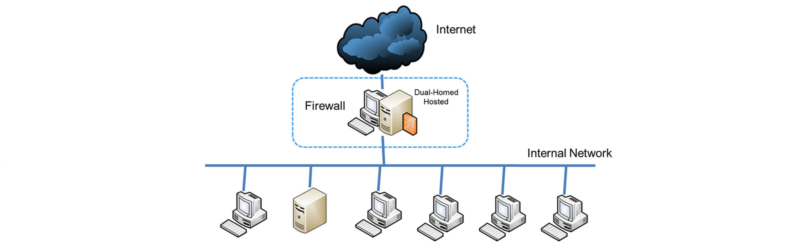
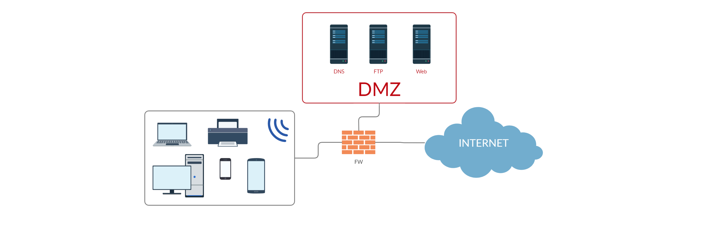
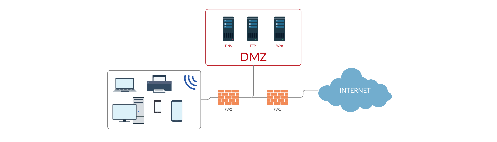
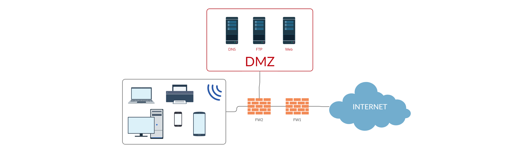
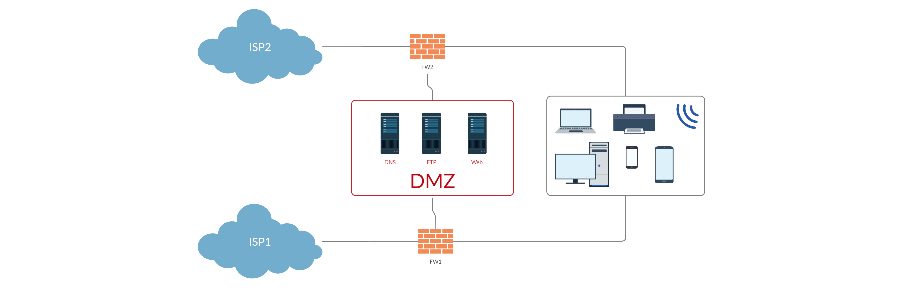

# Tema 3: Mecanismos de defensa en redes

## 1. Introducción

Cuestiones a tener en cuenta a la hora de defender redes:

- Red interna vs Red externa
- Seguridad perimetral más compleja/difusa
- Manejo de información sensible
- Gran variedad de servicios en red
- ...

Concepto de defensa en profundidad:

- Consiste en distribuir la defensa de la red y los activos a diferentes capas, para que se tengan que vulnerar todas esas capas.
- Primera capa: **Firewall**

## 2. Cortafuegos

### Definición

- Un cortafuegos (Firewall) es un sistema de seguridad que
monitoriza y controla el tráfico en base a reglas
- Es una barrera entre redes con diferentes políticas de seguridad


### Características

- Aparecen entre políticas diferentes de seguridad de red
- Define zonas confiables por las que los datos pueden
distribuirse sin peligro de su seguridad
- Centralizan la política de control relativa al acceso a terceras partes, entrada y salida
- Permiten separar el problema en dos partes: política interna frente a política de interconexión

### Funcionalidades

- Bloqueo de tráfico no deseado
- Control de tráfico hacia y desde la red privada
- Redirección de tráfico a sistemas internos
- Ocultación de sistemas vulnerables
- Ocultación de información: Nombres de sistemas, topología de
red, etc.
- Sistema de autenticación más robusto

## 3. `iptables`

- Componente construido sobre Netfilter
  - Interceptar y manipular paquetes en capas de red y de transporte.
- Herramienta de firewall → Stateful firewall (cortafuego de estados) (seguimiento de las conexiones)
- Formado por:
  - Tablas → Contiene cadenas
  - Cadenas → Contiene reglas de un mismo tipo
  - Reglas → Requisitos y targets para los paquetes

### Tablas

- **filter** → Filtra paquetes (es la que se usa por defecto)
- **nat** → NAT paquetes
- **mangle** → Modifica paquetes (por ejemplo su TTL)
- **raw** → Permite deshabilitar el connection tracking
- **security** → Usado por SELinux

### Cadenas

- **INPUT** → Paquetes de entrada
- **OUTPUT** → Paquetes de salida
- **FORWARD** → Paquetes para reenviar
- **PREROUTING** → Paquetes antes de ser enrutados
- **POSTROUTING** → Paquetes después de ser enrutados

No todas las cadenas existen en todas las tablas

- filter → INPUT, OUTPUT, FORWARD
- nat, mangle → PREROUTING, POSTROUTING

### Ruta de un paquete en `iptables`

```
                               XXXXXXXXXXXXXXXXXX
                               XXX     Red    XXX
                               XXXXXXXXXXXXXXXXXX
                                        +
                                        |
                                        v
 +--------------+             +-------------------+
 |tabla:  filter| <---+       | tabla:  nat       |
 |cadena: INPUT |     |       | cadena: PREROUTING|
 +-----+--------+     |       +--------+----------+
       |              |                 |
       v              |                 v
 [proceso local]      |     ************************       +---------------+
       |              +---+ Decisión de enrutamiento +---> |tabla: filter  |
       v                    ************************       |cadena: FORWARD|
************************                                   +------+--------+
Decisión de enrutamiento                                          |
************************                                          |
       |                                                          |
       v                    ************************              |
+--------------+      +---+ Decisión de enrutamiento <------------+
|tabla:  nat   |      |     ************************
|cadena: OUTPUT|      |                +
+-----+--------+      |                |
      |               |                v
      v               |      +--------------------+
+---------------+     |      | tabla: nat         |
|tabla:  filter | +---+      | cadena: POSTROUTING|
|cadena: OUTPUT |            +--------+-----------+
+---------------+                      |
                                       v
                               XXXXXXXXXXXXXXXXXX
                               XXX    Red     XXX
                               XXXXXXXXXXXXXXXXXX
```

### Estructura de las reglas

`iptables [-t tabla] comando [condición] [acción]`

Comandos:

- `-A` especifica la regla
- `-D` eliminar regla
- `-L` listar reglas
- `-F` elimina reglas (por cadena o de todas las cadenas)
- `-P` establece la política por defecto en una cadena
- ...

Opciones (varian en función del comando usado):

- `-v` modo verbose
- `-n` muestra valores numéricos para IPs, puertos, ...
- `-t` especifica a que tabla se aplica la regla
- `-p` protocolo
- `-s` IP origen
- `-d` IP destino
- `-i` interfaz de entrada
- `-o` interfaz de salida
- `--sport` puesto origen
- `--dport` puerto destino
- `-m state --state` estado de la conexión
- `-m multiport` permite especificar varios puertos a los que aplicar la regla
- ...

### Estados

Estados (Módulo coontrack):

- **NEW** → Nueva conexión
- **ESTABLISHED** → Conexión establecida
- **RELATED** → Nueva conexión asociada a otra establecida (abrir
nueva conexión dentro de una existente)
- **INVALID** → El paquete seleccionado no puede ser asociado a
una conexión conocida

Estados de una conexión TCP:

```
|    Cliente    |     Firewall     |     Servidor     |
|               |                  |                  |
|     -------   |                  |                  |
|     | SYN |------------+         |                  |
|     -------   |        |         |                  |
|               |        v         |                  |
|               |     -------      |                  |
|               |     | NEW |-----------------        |
|               |     -------      |         |        |
|               |                  |         v        |
|               |                  |    -----------   |
|               |                  |    | SYN/ACK |   |
|               |                  |    -----------   |
|               |                  |         |        |
|               | ---------------  |         |        |
|               | | ESTABLISHED |<-----------+        |           
|               | --------------   |                  |
|               |         |        |                  |
|     -------   |         |        |                  |
|     | ACK |<------------+        |                  |
|     -------   |                  |                  |
|               |                  |                  | 
```

### Acciones

- Si un paquete cumple los requisitos de la regla:
  - Se tendrá en cuenta la acción
- Si no cumple ninguna regla
  - Se tiene en cuenta la política
de la cadena

Acciones comunes:

- **ACCEPT** → Acepta el paquete
- **DROP** → Descarta el paquete
- **REJECT** → Deniega el acceso y notifica al remitente
- **LOG** -> Log del paquete

## 4. Topologías de defensa y DMZ

Establecer una topologia de defensa es complicado y delicado:

- Requiere planificación y establecer políticas, procedimientos, controles y responsables

Debe fundamentarse en:

- Una política de seguridad definida por la corporación
- Determinar los responsables y beneficiarios de los servicios
- Ubicación del cortafuegos
- Control y mantenimiento del funcionamiento

### Tipos de arquitecturas

#### Arquitectura simple



- Es la más sencilla de todas
  - Firewall para separa la red interna de internet
- Problemas:
  - Para exponer algún servicio hay que exponer la red interna
  - Ataques laterales

### DMZ

Es una red local que se se ubica entre la red externa y la interna
- Esta aislada de la red interna
- Se usa para que ciertos servicios se puedan acceder desde el exterior sin tener que acceder a la red interna

#### Arquitecturas con DMZ

####  Multi-Homed host con DMZ (three-legged firewall)



- Ventajas:
  - Aísla los elementos que se quieren tener accesibles a través de la red exterior
  - Un único cortafuegos para todo
- Contras:
  - Dependiendo de la carga puede ser un cuello de botella

#### Defensa en profundidad (DMZ entre cortafuegos)



- Ventajas:
  - Se pueden establecer controles iniciales comunes para la DMZ y la red interna y después establecer un cortafuegos a nivel de aplicación o con configuraciones mas complejas para la red interna
- Contras:
  - Requiere dos cortafuegos[^1]
  - Si se vulnera el primer cortafuegos la DMZ queda completamente expuesta

**NOTA:** Al usar dos cortafuegos es sumamente recomendable que sean de marcas o modelos diferentes, para evitar que ambos tengan las mismas vulnerabilidades

#### Defensa en profundidad (cortafuegos inicial + three-legged firewall)



- Ventajas:
  - Se puede establecer un primer cortafuegos de hardware y filtrar toda lo no necesario y dejar el resto de paquetes para un análisis mas complejo (como con el anterior)
  - Si se vulnera el primer firewall no queda ninguna parte de la red expuesta a vulnerabilidades
- Contras:
  - Requiere de dos cortafuegos [^1]

####  Defensa en profundidad (alta disponibilidad)



- Ventajas:
  - Dos puntos de acceso a internet: si falla uno el otro sigue activo (aumentas disponibilidad)
- Contras:
  - Aun teniendo dos firewalls con vulnerar uno se accedería a la red interna
