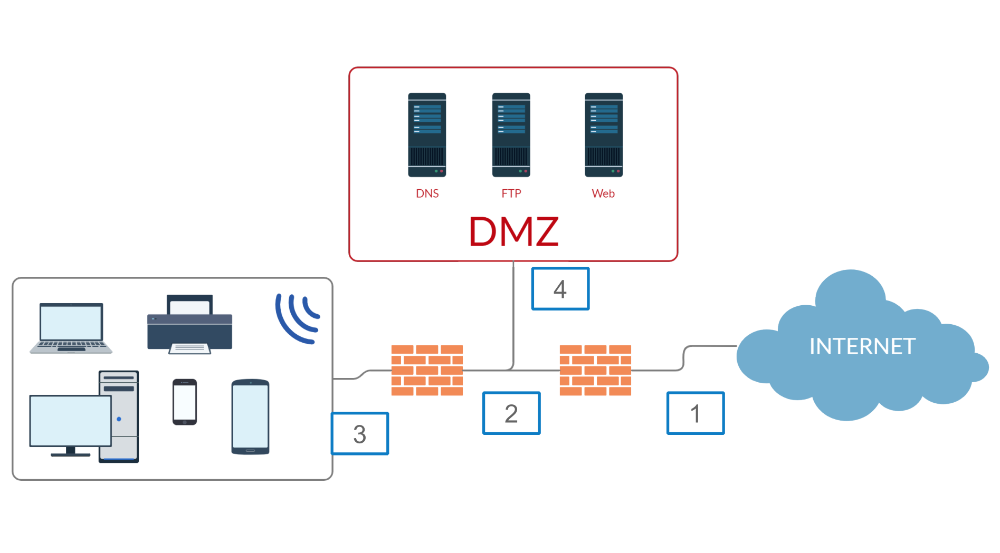
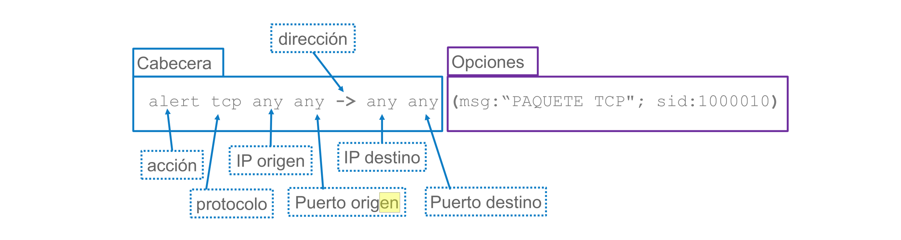
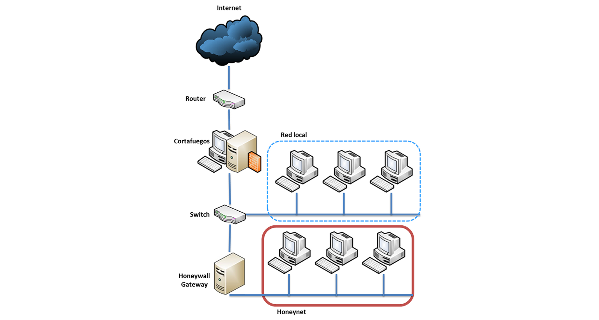

# Tema 4: Técnicas y Herramientas de Seguridad Proactivas

## 1. Introducción

- **Intrusión**
    - Secuencia de acciones realizadas por un atacante que resulta en el compromiso de un sistema
- **Detección de intrusión**
    - El proceso de identificación de intentos de ataques
- **IDS**
    - Programa que permite detectar la posible intención de generar una intrusión a un equipo o red
- **Anomalía**
    - Comportamiento que se desvía del normal

## 2. Sistemas de detección y prevención de intrusiones

- Tipos de IDS
    - **IDS de host (HIDS)**:
        - Funcionan a nivel de máquina
        - Monitorizar parámetros del sistema operativo.
    - **IDS de red (NIDS)**:
        - Se sitúan en la red
        - Capturar y monitorizar el tráfico

### Network IDS (NIDS)

- Analizan todo el tráfico y buscan actividad maliciosa
- *DIFICULTADES*:
    - **Entornos conmutados**
    - **Comunicaciones cifradas**
    - **Redes de alta velocidad**
- *Elementos*:
    - **Sondas**:
        - Elementos recolectores del sistema. Envían los eventos generados al sistema gestor
    - **Sistema gestor**:
        - Se encarga de almacenar y gestionar los eventos recibidos
    - **Consola de administración**:
        - Clasifica y muestra los eventos recibidos
    - **BD**:
        - Almacena el conocimiento del sistema

### Tipos de IDS

#### IDS basado en reglas

- **Buscan patrones** en el tráfico y en los usuarios y los comparan con BD de ataques (firmas de ataques)
    - Son **conceptualmente sencillos**
    - BD actualizadas a medida que surgen nuevos ataques
        - Necesitan **mantenimiento de la BD**
    - No detectan nuevos ataques que no hayan sido definidos previamente en su base de reglas
        - **No pueden detectar *zero days***
    - Falsos positivos/negativos

#### IDS basado en anomalías

- **Generan un modelo** del "comportamiento normal" y buscan desviaciones del mismo
    - **Pueden llegar a detectar *zero days***
    - Parten de la definición de un modelo de comunicaciones
    - Los **sistemas heterogéneos suponen un reto** para estos sistemas
    - **¿Qué tráfico es normal?**

### Sistemas de Prevención de Intrusión (IPS)

- IDS + Cortafuegos de tráfico
- Son elementos activos
    - Se colocan **en línea** en la red no en paralelo a esta
    - Problema con redes de alta velocidad

### Despliegue y localización

- Dos modos de colocación:
    - **Network tap**
        - Usado para NIDS
        - El IDS no es detectado por la red
    - **Inline**
        - Usado para IPS
        - Permite cortar las conexiones
        - Limita el rendimiento en redes con mucho tráfico

#### Network tap


#### Inline


#### Colocación IDS/IPS en una red



### Verificador de integridad de ficheros

- Herramienta que puede usarse como complemento de un IDS
- Usa hashes y checksums para comparar valores y encontrar diferencias en ficheros

## 3. Snort

### Usos

```bash
# 1. Sniffer
snort -vde

# 2. Packet Logger
snort -vde -l ./log

# 3. NIDS / IPS
snort -d -l ./log -c snort.conf
```

### Parámetros

- `-v`: Mostrar paquetes con cabeceras TCP/IP por consola
- `-d`: Mostrar datos de capa de aplicación
- `-e`: Mostrar cabeceras nivel 2 (enlace)
- `-q`: Modo silencioso
- `-l log`: Para especificar el directorio para guardar capturas (pod defecto `/var/log/snort`)
- `-b`: Guardar paquetes en modo binario
- `-r packets.log`: Analizar paquetes previamente guardados en el log especificado
- `-c snort.cong`: Fichero de configuración de alertas (por defecto `/etc/snort/snort.conf`)
- `-A`: Modo de presentación de alertas
    - `- fast`: Timestamp + mensaje + IP/Port origen y destino
    - `- full`: Por defecto ("fast" + cabecera)
    - `- unsock`: Envía a un socket
    - `- none`: Desactiva las alertas
    - `- console`: Modo "fast" enviado a consola
    - `- cmg`: "full" + contenido del paquete
- `-k none`: No comprobar checksum
- `-i eth0`: Seleccionar interfaz
- `-D`: Modo demonio

### Configuración

- La configuración se hace en ficheros `.conf`
    - Por defecto `/etc/snort/snort.conf`
    - `/etc/snort/rules` para las reglas más comunes
- Variables
    - `var`: variable de texto
    - `ipvar`: IP o rango de IPs
    - `portvar`: puerto o rango de puertos

```bash
ipvar HOME_NET [192.168.1.0/24,10.1.1.0/24]
ipvar EXTERNAL_NET !$HOME_NET
ipvar [HTTP_SERVERS [192.168.1.50,192.168.1.52]
pportvar FTP_PORTS [21,2100,3535]
pportvar FILE_DATA_PORTS [$HTTP_PORTS,110,143]
----
ipvar EXAMPLE [1.1.1.1,2.2.2.0/24,![2.2.2.2,2.2.2.3]]
```

- Reglas



- Acciones
    - `alert`: Genera una alerta y guarda el paquete
    - `log`: Guarda el paquete
    - `pass`: Ignora el paquete
    - `activate`: Lanza una alerta y active otra regla
    - `dynamic`: Permanece inactiva hasta que se activa por una regla activate (después actúa como log)
    - `drop`: Bloquea y guarda el paquete
    - `reject`: Bloquea, guarda el paquete y envía un TCP reset si el protocolo es TCP o un ICMP port unreachable si el protocolo es UDP
    - `sdrop`: Bloquea el paquete pero no lo guarda

- Parámetros
    - Sirven como mecanismos para detectar elementos en los *payload*
    - Los básicos
        - `mgs`
        - `gid`
        - `sid`
        - `rev`
    - Para detectar en el propio mensaje
        - `content`
        - `offset`
        - `depth`
        - `distance`
        - `within`
        - `nocase`
    - Para detectar en los campos de los paquetes
        - `ttl`
        - `sequ`
        - `flags`
        - `ack`
        - `dsize`
        - `flow`
    - Post-detección
        - `activates`
        - `activated_by`
        - `count`
        - `resp`
        - `logto`

### Ejemplos

#### Ejemplos de payload

```bash
# Busca ABC en el contenido de lo paquetes
content: "ABC";
# Busca la palabra GET desde el inicio del payload y la palabra download desde el byte 13
content: "GET"; offset:0; content: "downloads"; offset:13;
# Buscar la palabra GET en los tres primeros bytes del payload
content: "GET"; depth:3;
# Buscar la palabra GET en los tres primeros bytes del payload y después moverse 10 bytes relativos al final de GET y empezar a buscar por la palabra download
content: "GET"; depth:3; content: "downloads"; distance:10;
# Buscar la palabra GET en los tres primeros bytes del payload y después moverse 10 bytes relativos al final de GET y empezar a buscar por la palabra download, pero solamente en los 9 bytes siguientes
content: "GET"; depth:3; content: "downloads"; distance:10; within:9;
# Igual que la anterior, pero sin tener en cuenta mayúscules y minúsculas
content: "GET"; depth:3; nocase; content: "downloads"; distance:10; within:9; nocase;
```

#### Ejemplos de no-payload

```bash
# Busca los paquetes con ttl menor o igual a 5
ttl:<=5;
#Busca el flag URG y PSH en la cabecera TCP, además de otros flags (no solo estos dos)
flags:+UP;
# Identifica todos los paquetes que tienen la conexión TCP establecida
flow: established
# Busca paquetes con número de secuencia 89 (ack es similar, ack: 89)
seq: 89
# Localizamos los paquetes con un contenido de carga entre 300 y 400
dsize:300<>400

```

#### Ejemplos de post-detección

```bash
# Activa la regla 5 cuando nosotros mismos somos ejecutados (consideramos que nosotros tenemos el sid 8)
activates: 5;
# Esta regla es la que es ejecutada cuando el trigger es activado (regla con parámetro activates)
activated_by: 8
# Indica la cantidad de paquetes que van a recibir la acción de la regla anterior, desactivando esta misma una vez se expira este contador
count: 50
# Envía un TCP RST a cada uno de los extremos de la conexión TCP
resp: rst_a11
# Guarda toda la información en el fichero de log 11 llamado "logespecial"
logto:"logespecial";
```

#### Ejemplos de ping

```bash
sudo snort -c snort-icmp-todos.conf -1 log -A console -i lo

# Detección de todos los mensajes ICMP
alert icmp any any -> any any (msg: "ICMP Packet" ; sid:477; rev:3; )
# Detección de todos los mensajes ICMP mayores de 200 bytes
alert icmp any any -> any any (msg:"ICMP Packet" ; sid:477; rev:3; dsize: > 200;)
```

## 4. Sistemas trampa

### HoneyPots


- **Sistemas simulados** que **imitan** la conducta de **servicios reales**
- *FUNCIONES*:
    - **Distracción**
        - Presentar vulnerabilidades muy conocidas
    - **Detección**
    - **Análisis**
        - Recopilar el máximo de información del atacante y sus técnicas
        - Investigación – Machine Learning – Reglas
- **¿Dónde colocar un honeypot?**
    - En el interior de la red

### HoneyNet



- Tipo especial de honeypots
- **Red entera** diseñada para ser atacada
    - Se usan **equipos reales** (físicos o virtuales) con SO y apps reales
    - Recopilar el máximo de información del atacante y de las técnicas
- Sistemas **difíciles de configurar**
    - SO reales con servicios reales (datos ficticios)
- **¿Dónde desplegar una honeynet?**
    - En un segmento separado pero conectado a la red y detrás del FW

### Padded Cell (Célula de aislamiento)


- IPS + sistema trampa (Honeypot o Honeynet).
- El IPS redirige el tráfico potencialmente de ataque al Padded Cell para ser estudiado
- Dificultad para administrarlos
- **¿Dónde colocar un Padded Cell?**
    - En otro segmento de red tras el switch

### Tipos de señuelos

- **Baja interacción**
    - :heavy_plus_sign: **Simulan** servicios, aplicaciones y sistemas operativos
    - :heavy_plus_sign: **Riesgo bajo**
    - :heavy_plus_sign: **Fáciles** de implantar y mantener
    - :heavy_minus_sign: Son **fácilmente detectables** por atacantes con experiencia
    - :heavy_minus_sign: Capturan una cantidad de **información limitada**
- **Alta interacción**
    - :heavy_plus_sign: / :heavy_minus_sign: Servicios, aplicaciones y SO **reales**
    - :heavy_plus_sign: Capturan **mucha información**
    - :heavy_minus_sign: Suponen un **alto riesgo**
    - :heavy_minus_sign: **Difíciles** de implantar y mantener
- Ejemplos
    - [MHN (Modern Honey Network)](<https://github.com/threatstream/mhn>)
    - [T-Pot](<https://github.com/dtag-dev-sec/tpotce/releases>)
    - Incluyen, entre otros:
        - Kippo (SSH)
        - Glastopf (WEB)
        - Dionaea (Busqueda Malware en FTP, SMB, HTTP, ...)

## 5. Escáner de vulnerabilidades

- Herramienta **activa** que permite realizar un conjunto de pruebas sobre un sistema o red
    - Para encontrar debilidades y/o fallos de seguridad
- Proceso de análisis:
    - **Muestreo** de un conjunto específico
    - **Comparación** de los **resultados**
    - Generación de un **informe**
- Dos tipos de análisis
    - **Basados en máquina**
        - "Antivirus" de toda la vida
    - **Basados en red**
        - Se conectan al objetivo a analizar
        - Dos técnicas
            - **Testing by exploit**
                - Consiste en lanzar atanques
                - Es muy agresivo
                - Es efectivo
            - **Metodos de inferencia**
                - Es un método pasivo
                - Busca rastros
                - Busca "puertas abiertas"

## 6. Test de penetración (Pentest)

- **Descubrimiento**
    - Recolección de información acerca del sistema
- **Exploración**
    - Escaneo telefónico, identificación de la topología de la red
- **Evaluación**
    - Detección manual y automática de vulnerabilidades y evaluación del riesgo
- **Intrusión**
    - Intento de acceso al sistema
- **Informe**
    - Documentación sobre todo el proceso y las contramedidas que deben llevarse a cabo

## 7. Gestor de eventos de seguridad (SIEM)

- *Security Information & Event Management*
- Es un sistema integral para gestionar la seguridad
- **Interconecta muchos "módulos"** como
    - IDS/IPS
    - Sistemas de detección de malware
    - Analizadores de paquetes
    - Firewalls
    - ...
- **Recibe también** información de bases de datos de:
    - BD de vulnerabilidades
    - BD de patrones de amenazas
    - BD de eventos
- Permite **generar respuestas** ante incidentes **y reportes** sobre la seguridad
