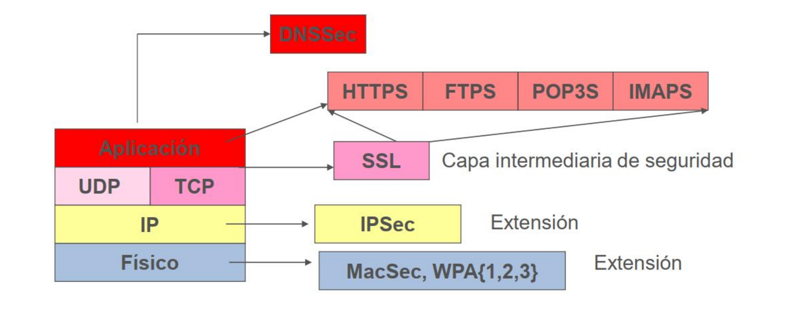
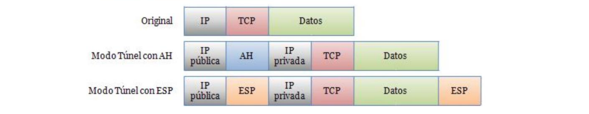
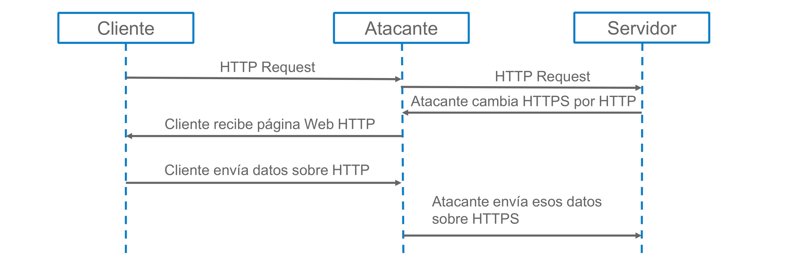
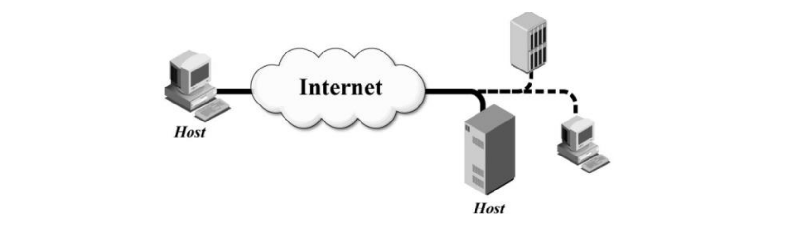

# Tema 5: Protocolos de Seguridad

## 1. Introducción



## 2. Seguridad en Redes Inalámbricas

### Wi-Fi

- **Wi-Fi** (Wireless Fidelity): **Marca** que certifica la interoperabilidad de equipos **bajo el estándar IEEE 802.11**
- Rangos de frecuencia:
    - 2.4 GHz: 802.11b/g/n...
    - 3.6 GHz: 802.11y
    - 4.9/5.0 GHz: 802.11a/h/j...
- **Diversos Estándares**:
    - Seguridad: 802.11i, 802.11w
    - 802.11-1997, 802.11-2007, 802.11-2012, 802.11-2016
- **Canales** Wi-Fi
    - El número depende de la región
        - EEUU: 11 canales
        - Europa: 13 canales
        - Japón: 14 canales
    - Inicialmente  canales de ancho de banda 20/22 MHz
        - Nuevos estándares con mayor ancho
        - 802.11ac: 5GHz. Anchos de banda de 20, 40, 80 y 160 MHz

### Tipos de paquetes Wi-Fi

- **Management Frames**
    - Asociación, Autenticación, Probe, ...
- **Control Frames**
    - RTS, CTS, ACK, ...
- **Data Frames**
    - Datos, QoS, ...

```text
 Cliente                                                              AP
 =======                                                            ======
    |                                                                  |
    |                                                                  |
    |     1. Probe Request                                             |
    | ------------------------------------------------------------->>> |
    |                                                                  |
    |                                                                  |
    |                                           2. Probe Response      |
    | <<<------------------------------------------------------------- |
    |                                                                  |
    |                                                                  |
    |     1. Authentication Request                                    |
    | ------------------------------------------------------------->>> |
    |                                                                  |
    |                                                                  |
    |                                  4. Authentication Response      |
    | <<<------------------------------------------------------------- |
    |                                                                  |
    |                                                                  |
    |     1. Association Request                                       |
    | ------------------------------------------------------------->>> |
    |                                                                  |
    |                                                                  |
    |                                     6. Association Response      |
    | <<<------------------------------------------------------------- |
    |                                                                  |
    |                                                                  |
```

### Mecanismos de Seguridad Básicos

- Uso de protocolos de **capas superiores**
- **Aislamiento Físico**
- ACLs de MACs
- **Red Oculta** (Hidden SSID)

### WEP

- Autenticación WEP
    - Open System Authentication (OSA)
    - Shared Key Authentication (SKA)
- Confidencialidad e Integridad WEP
    - Sistema de cifrado incluido en el estándar original IEEE 802.11
    - Basado en el algoritmo de cifrado **RC4**
        - Normalmente con claves de 128 bits
            - 104 bits + 24 bits del vector de iniciación IV

#### Vulnerabilidades y Ataques WEP

- **Esta roto desde hace tiempo**
- Autenticación Insegura
    - AP Falso (Rogue AP)
- Integridad Insegura
- Confidencialidad
    - Colisión de Vectores de Inicialización (IV)
    - Uso de Clave Estática y Compartida
    - Ataque Generación Secuencia Cifrante (IV débiles)
    - Ataque reenvío
    - Ataque Fragmentación
    - Ataque Chop Chop
    - Ataque Caffe-Latte

### WPA

- Propuesto por la Wi-Fi Alliance para solucionar las vulnerabilidades de WEP
- Definido en el estándar 802.11i
    - WPA: **compatible** con hardware anterior
    - WPA2: **nueva** versión **incompatible**
- Características WPA:
    - **IV** de 48 bits
    - **TKIP** (*Temporal Key Integrity Protocol*)
        - Cambia dinámicamente las claves
        - Diferente para cada usuario
    - Usa un algoritmo llamado **Michael** para generar un **Message Integrity Check** (MIC)
    - Usa el algoritmo **RC4**

### WPA2

- Diseñado para sustituir a WPA
- Usa vectores de inicialización (IV) de 48 bits
- Claves dinámicas y diferentes para cada usuario
- Usa el modo:
    - Counter Cipher Mode with Block Chaining Message Authentication Code Protocol
        - de **AES (AES-CCMP)**
-Versiones:
    - WPA2-Personal
        - Uso doméstico y en pequeñas empresas
        - **Clave precompartida WPA-PSK** (de 8 a 63 caracteres)
        - PMK = PBKDF2(HMAC−SHA1, PSK, SSID, 4096, 256)
    - WPA2-Enterprise
        - Uso en grandes organizaciones
        - **Claves diferentes para usuarios distintos**
        - Requiere 802.1x y EAP (RADIUS)
        - Autenticación mediante el protocolo **EAP**

#### Ataques a WPA2

- **Ataque a PSK**
    - WPA2-Personal
- **Rogue AP**
    - WPA2-Enterprise
- BYO Disaster:
    <https://www.youtube.com/watch?v=-uqTqJwTFyU>
- **Ataque DoS contra Michael** en WPA
- Ataque Becks-Tews contra WPA
- Ataques contra **WPS** (*Wi-Fi Protected Setup*)
    - <https://null-byte.wonderhowto.com/how-to/hack-wpa-wpa2-wi-fipasswords-with-pixie-dust-attack-using-airgeddon-0183556/>
- **KRACK** Key Reinstallation Attack
    - <https://www.krackattacks.com/>
- **Phising**
    - Known Beacons, KARMA
- TOOLS:
    - `kismet`, `aircrack-ng`, `cowpatty`, `Reaver`, `wifiphise`

### WPA3

- **SAE reemplaza PSK** (Simultaneous Authentication of Equals)
    ► Resistencia a KRACK
    ► Resistencia a ataques de diccionario
    ► Forward Secrecy
- **PMF obligatorio** (*Proteted Management Frames*)
- **OWE** (*Oportunistic Wireless Encryption*)
- WPA3-Enteprise cifrado de 192-bits
- WPA3-enterprise CNSA
- **Substituye WPS** por Easy Connect (Códigos QR)
- **Compatible con dispositivos WPA2**

#### Ataques WPA3

- **Dragonblood**
    - *Analysing WPA3's Dragonfly Handshake* (<https://wpa3.mathyvanhoef.com/>)
    - *CERT ID #VU871675*:
        - Downgrade attack against WPA3-Transtition mode leading to dictionary attacks
    - *CERT ID #VU871675*:
        - Security group downgrade attack against WPA3's Dragonfly handshake
    - *CVE-2019-9494*:
        - Timing-based side-channel attack against WPA3's Dragonfly handshake
    - *CVE-2019-9494*:
        - Cache-based side-channel attack against WPA3's Dragonfly handshake
    - *CERT ID #VU871675*:
        - Resource consumption attack (i.e. denial of service) against WPA3’s Dragonfly handshake
    - TOOLS:
        - Dragonslayer, Dragondrain, Dragontime, Dragonforce

### **Recomendaciones** para redes inalámbricas

- **Usar WPA3**
- Usar **WPA2 mientras WPA3 no sea posible**
    - Preferiblemente versión Enterprise con un mecanismos EAPTLS, EAP-TTLS
    - Si se usa WPA2-Personal utilizar una clave segura
        - Cambiar el SSID de la Red
- **Complementar** la seguridad **con un mecanismo de seguridad en una capa superior** (e.g. VPN)
- Solo utilizar WPA si hay dispositivos de la red no soportan WPA2
- **WEP no debe utilizarse** salvo que sea la única alternativa
- **Deshabilitar servicios innecesarios** que pueden ser vulnerables, e.g. **WPS**

## 3. IPSec

> <https://tools.ietf.org/html/rfc4301>

- Mecanismos de seguridad sobre capa de red
- Negociaciones e Intercambio de Clave
    - **IKE** (*Internet Key Exchange*):
        - Usado para negociar parámetros de seguridad, clave, etc.
- Seguridad
    - **AH** (*Authentication Header*) [(RFC 4302)](https://tools.ietf.org/html/rfc4302)
        - Proporciona **Integridad** y **Autenticación**
    - **ESP** (*Encapsulating Security Payload*) [(RFC 4303)](https://tools.ietf.org/html/rfc4303)
        - Proporciona **Confidencialidad**
        - Depende del modo tambien puede proporcionar **Integridad** y **Autenticarión**
- Opcionales
    - **IPComp**: Usado para comprimir

### Modos de operación IPSec

#### **Transport mode**

- **Protección primaria** para las **capas superiores**
    - No modifica ni encapsula el protocolo IP
- Seguridad entre los extremos de la comunicación


#### **Tunnel mode**

- Protección a **todo el paquete IP**
    - Modifica el paquete (encapsulándolo dentro de otro)
- **Seguridad entre los extremos** del túnel (podría ser el extremo de la comunicación o no



### Authentication Header (AH)

- Proporciona **integridad y autenticación** a los datagramas IP
- Se realiza computando una **función resumen sobre el datagrama**
    - Empleando una clave secreta en dicho cálculo
- La información de auntenticación se calcula utilizando:
    - Todos los campos del datagrama que no van a cambiar durante el tránsito

#### Formato

```text
    0                   1                   2                   3
    0 1 2 3 4 5 6 7 8 9 0 1 2 3 4 5 6 7 8 9 0 1 2 3 4 5 6 7 8 9 0 1
   +-+-+-+-+-+-+-+-+-+-+-+-+-+-+-+-+-+-+-+-+-+-+-+-+-+-+-+-+-+-+-+-+
   | Next Header   |  Payload Len  |          RESERVED             |
   +-+-+-+-+-+-+-+-+-+-+-+-+-+-+-+-+-+-+-+-+-+-+-+-+-+-+-+-+-+-+-+-+
   |                 Security Parameters Index (SPI)               |
   +-+-+-+-+-+-+-+-+-+-+-+-+-+-+-+-+-+-+-+-+-+-+-+-+-+-+-+-+-+-+-+-+
   |                    Sequence Number Field                      |
   +-+-+-+-+-+-+-+-+-+-+-+-+-+-+-+-+-+-+-+-+-+-+-+-+-+-+-+-+-+-+-+-+
   |                                                               |
   +            Authentication Data (Contiene el MAC)              |
   |                                                               |
   +-+-+-+-+-+-+-+-+-+-+-+-+-+-+-+-+-+-+-+-+-+-+-+-+-+-+-+-+-+-+-+-+
```

#### AH (transporte)


#### AH (túnel)


### Encapsulating Security Payload (ESP)

- **Se cifra el datagrama** y este **se incluye en un paquete ESP**

#### Formato

```text
   +-+-+-+-+-+-+-+-+-+-+-+-+-+-+-+-+-+-+-+-+-+-+-+-+-+-+-+-+-+-+-+-+
   |                 Security Parameters Index (SPI)               |
   +-+-+-+-+-+-+-+-+-+-+-+-+-+-+-+-+-+-+-+-+-+-+-+-+-+-+-+-+-+-+-+-+
   |                    Sequence Number Field                      |
   +-+-+-+-+-+-+-+-+-+-+-+-+-+-+-+-+-+-+-+-+-+-+-+-+-+-+-+-+-+-+-+-+
   |                                                               |
   +                Encrypted Data and Parameters                  +
   |                                                               |
   +-+-+-+-+-+-+-+-+-+-+-+-+-+-+-+-+-+-+-+-+-+-+-+-+-+-+-+-+-+-+-+-+
   |                                                               |
   +             Authentication Data (Contiene el MAC)             |
   |                                                               |
   +-+-+-+-+-+-+-+-+-+-+-+-+-+-+-+-+-+-+-+-+-+-+-+-+-+-+-+-+-+-+-+-+
```

#### ESP (transporte)


#### ESP (túnel)


### Internet Key Exchange (IKE)

- **Basado en ISAKMP** (*Internet Security Association and Key
Management Protocol*)
- **Security Association** (SA)
    - Relación entre dos o más entidades que describe:
        - cómo éstas utilizarán los servicios de seguridad para comunicarse de forma segura

- **Fase I**:
    - Autenticación de las partes y protección del canal de comunicación
    - SA ISAKMP
    - Modos: Main (6) y Aggressive (3)

- **Fase II**:
    - Negociación de al menos una SA en cada sentido
    - SA IPSEC
    - Modo Quick (3)

## 4. SSL/TLS

### Historia

- *Security Socket Layer*
- Desarrollado por Netscape hasta la versión 3.0
    - En el año 1996, en plena Guerra de Navegadores con Microsoft
- SSLv3.0 sirve de base al IETF para Tranport Layer Security (TLS)
    - Transport Layer Security 1.0, RFC 2246 (1999)
    - Transport Layer Security 1.1, RFC 4346 (2006)
    - Transport Layer Security 1.2, RFC 5246 (2008)
    - Transport Layer Security 1.3, RFC 8446 (2018)
- Problemas de seguridad
    - Restricción en la longitud de las claves utilizadas

### Formas de trabajo SSL/TLS

- Genera un canal cifado
    - **Confidencialidad**
- Certificado del servidor
    - **Autenticidad del servidor**
- OPCIONAL: Certificado del clienteo
    - *Autenticidad del cliente*

### Pila de protocolo SSL


#### SSL Record Protocol


#### SSL Alert Protocol

- Gestiona la sesión SSL y los mensajes de error y advertencias (warning, critical y fatal), como por ejemplo:
    - Unexpected message
    - Bad record MAC
    - Decompression failure
    - Bad certifícate
    - Certificate revoked
    - Certificate expired
    - ...

#### SSL Handshake Protocol


- **Se negocian** los algoritmos
    - **Algoritmo de cifrado simétrico** (por ejemplo: AES256)
    - **Método de intercambio de claves** (por ejemplo: DH)
    - **Funciones hash** (POR ejemplo: SHA256)
- **Autenticación del servidor obligatoria**
    - Opcionalmente se autentica al cliente
- Se genera el secreto compartido


### Ataques a SSL/TLS

- **Heartbleed**
    - Error de la librería OpenSSL
    - Afecto a un gran número de compañias
    - Más info: <http://heartbleed.com/>
- **POODLE**
    - **Padding Oracle On Downgraded Legacy Encryption**
    - Mac-then-encrypt
    - Error con la validación con padding oracle al utilizar el cifrado de bloque en modo CBC en SSLv3
    - Posteriormente se ha publicado que también puede afectar a algunas implementaciones de TLS que no siguen la recomendación del RFC de comprobar el contenido del padding
- **DROWN**
    Decrypting RSA with Obsolete and Weakened eNcryption
    - Más info: <https://drownattack.com/>
- **SSLStrip**

    

## 5. Redes Privadas Virtuales (VPN)

*Virtual Private Networks*
Proveen canales seguros de Comunicación sobre redes inseguras
Es una alternativa más barata y facil a las redes físicas privadas

### Arquitecturas VPN

- Se pueden desplegar usando diferentes protocolos como IPSec y SSL:
    - NIST SP 800-77: *Guide to IPSec VPNs*
    - NIST SP 800-113: *Guide to SSL VPNs*

#### Gateway-to-Gateway Architecture


- Es la arquitectura tipica para una red empresarial distribuida entre varias oficinas
- Asegura la parte que es externa (Internet) a la las redes que se quieren conectar
- El mejor protocolo para esto es IPSec

#### Host-to-Gateway Architecture


- Es la arquitectura para conextarse a una red privada "desde fuera" (teletrabajo, por ejemplo)
- Asegura desde el host hasta que se llega al gateway
- Para esto se suele usar SSL

#### Host-to-Host Architecture



- Permite estabjeces un tunel entre dos host especificos que se encuentren en redes diferentes
- Asegura la conexion extremo a extremo
- Para esto se suele usar SSL
