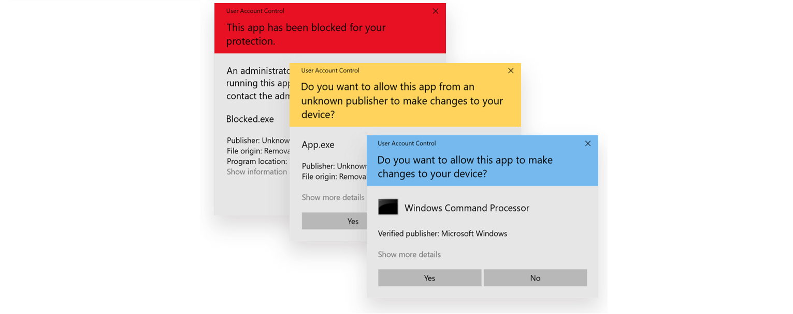

# Tema 1: Seguridad en Windows 7/8/10

## 1. Windows 7

### User Access Control (UAC)

Permite controlar los privilegios:

- Aplica el **principio de mínimo privilegio**
    - Un usuario administrador:
        - Token de usuario normal + token de administrador
- Evita el uso del token del administrador para operaciones que no lo requieren
- Cuando se intenta usar el de administrador (elevación) se presenta una **ventana de diálogo UAC** para pedir permiso o credenciales
    - Los diálogos de elevación usan un código de colores:
        - **Rojo**: si esta bloqueada la aplicación (GPO) o el publisher de esa aplicación (no permite arrancar)
        - **Amarillo**: Si el publisher es desconocido
        - **Azul**: si ESa firmado por Microsoft to el publisher esta verificado
    - Se puede configurar cuándo se pregunta al usuario y si utiliza el modo de escritorio seguro

### BitLocker

- **Cifrado completo de la unidad** de sistema o de una unidad de datos
    - BitLocker to Go para unidades extraíbles
- Cifrado mediante AES-CBC o XTS-AES de 128 o 256 bits
- *Panel de control → Sistema y Seguridad → Cifrado de unidad BitLocker*
- Alternativas
    - TrueCrypt: Freeware (Comprometida y descontinuada)
    - **VeraCrypt**: Open source y confiable

### AppLocker

- Herramienta avanzada para el **control de ejecución de aplicaciones y scripts**.
    - Se puede usar en **local o** a través de **GPOs**
- Es una herramienta flexible que **se basa en reglas**, con las que se puede hacer cosas como:
    - Permitir/denegar ejecución por **extensiones de archivo, ruta o hash**
    - Usar **whitelists** para permitir unicamente una serie de aplicaciones
    - Usar **blacklists** para denegar la ejecución de aplicaciones que no están en la lista de permitidas o que puedan tener malware
    - Denegar aplicaciones que consuman demasiados recursos o tengan efectos negativos sobre la máquina
- *Secpol.msc → Directiva de seguridad local → Directivas de control de aplicaciones → AppLocker*

### Firewall de Windows

- Permite regular el trafico de entrada y salida a través de reglas a puertos y servicios filtrando por usuario, grupo, interfaz,...
- Tiene 3 perfiles diferenciados (Dominio / Privado / Público)
- *Panel de control → Sistema y seguridad → Firewall de Windows*

### Direct Access

- Crear **conexiones remotas a través de VPN** usando IPsec entre equipos de una **misma red**
    - Similar a una VPN sin la intervención del usuario
- El usuario no tiene que establecer la conexión
    - No tiene que reconectar en caso de corte de conexión
- Las políticas de grupo se aplican antes de iniciar sesión
- Compatible con Network Access Protection (NAP)
- Cifrado con IPsec en modo ESP

### Windows Biometric Framework (WBF)

- Añade la capacidad de autenticar al usuario mediante sensores biométricos
    - Actualmente no se usa (**Windows Hello**)

## 2. Windows 8

### Microsoft Defender

- Es la mayor novedad con respecto a la seguridad de Windows 7
- Primera iteración (en Windows 10 mejora bastante)
- Antispyware/antivirus
    - Protección en tiempo real
    - Escaneo activo
- Viene integrado en el propio sistema

### Generación de contraseñas mediante imágenes

- Nuevo método de autenticación en el Sistema
    - Basado en patrones sobre imágenes
- Parecido a lo que hay en Android pero con una imagen por debajo
- Poco usado

### Secure Boot

- Destinado a garantizar que los equipos arranquen usando solamente el software de confianza
- El firmware comprueba la firma de cada fragmento de software de arranque (controladores y SO) como paso necesario para transferir el control al SO

### Navegación segura y SmartScreen

- Filtro de phishing y malware para varios productos de Microsoft
- Escaneo de URLs y blacklists con sitios web peligrosos

### Enhanced Mitigation Experience Toolkit (EMET)

- Capa de seguridad para prevenir que se exploten vulnerabilidades de seguridad en el software
- Entre otras cosas, permite configurar DEP y ASLR:
    - **ASLR** (*Address Space Layout Randomization*):
        - Organiza aleatoriamente las posiciones de las áreas de datos clave de un programa en memoria
            - Para evitar ataques de tipo *buffer overflow* y similares
    - **DEP** (*data execution prevention*):
        - Marca áreas de la memoria como "ejecutable" o "no ejecutable"
            - Asi se evita saltar a ejecutar código incrustado en la zona de datos mediante algún tipo de técnica de inyección
        - Modos por HW y SW

### Interfaz METRO con Sandbox

- ***Sandbox*** para ejecución segura de aplicaciones
- Permite ejecutar las aplicaciones en un entorno aislado
    - Asi se evita el alcance y las capacidades de aplicaciones que pudieran estar infectadas

### Mejoras en el Administrador de Tareas

- Herramienta que se encarga de actuar como gestor de procesos, servicios, aplicaciones y de monitor del sistema
- También permite establecer prioridades, controlar las aplicaciones que inician con Windows y reiniciar o detener programas

## 3. Windows 10

Windows 10 mejora en una serie de aspectos la seguridad con respecto a anteriores versiones:

- **Privacidad**:
    - Opciones de privacidad que están deshabilitadas pero se encuentran disponibles
- **Navegador** Microsoft Edge
    - Sandbox, SmartScreen,...
- **Mejoras en BitLocker**
    - XTS-AES, usabilidad
- **Mejoras en Windows Defender**
    - Bootkits, rootkits, integración en el SO
- **Windows Hello**
    (autenticación biométrica y multifactor)

## 4. Windows Server 2008/2012/2016

Son versiones especificas de Windows orientadas a servidores. Añaden funcionalidades típicas como:

- **Controlador de Dominio** (Domain Controller)
- Servidor de **WINS** (Windows Internet Naming Service) (Compatibilidad NetBIOS)
- Servidor de **DNS** y de **DHCP**
- Servidor de Terminal Server (Remote Desktop server)
- Servidor de archivos
- Servidor de impresión
- Servidor de correo electrónico (MS Exchange)
- Servidor web **IIS** (*Internet Information Services*)
- Servidor de Máquinas Virtuales (Hyper-V) y Contenedores

### Active Directory (AD)

- Implementación de Microsoft de **servicio de directorio** en una red distribuida de computadoras
- Usa *distintos protocolos* como:
    - LDAP
    - DNS
    - DHSCP
    - Kerberos
- Sirve para crear *objetos* como: usuarios, equipos o grupos
    - Para poder administrar los inicios de sesión en los equipos conectados a la red
- Estructura **jerárquica** con **BD central**, organizada y accesible:
    - **Objeto**: nombre genérico para cualquier componente (impresora, carpeta compartida, usuario, grupo, ...)
    - **OU** (Organizational Unit): contenedor de objetos para organizar los objetos dentro de un dominio
    - **Dominio**: conjunto de máquinas que comparten una misma BD de AD
    - **Árbol**: una serie de dominios relacionados
    - **Bosque**: conjunto de arboles relacionados
- Permite a los administradores establecer **políticas a nivel de empresa**:
    - Desplegar programas
    - Aplicar actualizaciones
    - Restringir elementos
    - ...

### Directivas de seguridad

- **Conjunto de reglas** que permiten:
    - Configurar **características** → Accesos, privilegios, etc.
    - Sobre **cuentas, usuarios (grupos) y equipos**
    - De manera flexible y útil desde el punto de vista de la seguridad de la información
- Dos tipos:
    - **Directivas Locales**: Se establecen **sobre la propia máquina**
    - **Directivas de Grupo** (GPO): Se aplican **sobre el dominio**, o parte de él
- Sitios útiles:
    - `gpedit.msc`
    - `%systemroot%\System32\GroupPolicy` directorio donde se almacenan las GPO
    - `gpupdate /Force` para poder actualizar

#### Políticas de contraseñas

- Directivas concretas para gestionar parámetros a la hora de tratar con contraseñas
    - *Secpol.msc → Directivas de cuentas → Directivas de Contraseñas*

## 5. Contraseñas en Windows

### Política de contraseñas

- La forma más común y sencilla de autenticación
- Riesgos:
    1. Robos de contraseña:
        - Phishing
        - Shoulder surfing
        - Keylogger
    2. Te adivinan la contraseña (predecible):
        - Social engineering
        - Password spraying
    3. Un tercero filtra tu clave (reutilizada):
        - Password stuffing attack
    4. Vulneran el almacén de claves (corta):
        - Password cracking

### Ataques a contraseñas

#### Búsqueda inteligente (ataque de canal lateral)

- Son toda la serie de técnicas que buscan obtener la contraseña de manera indirecta
    - Phishing
    - Shoulder surfing
    - Keylogger
    - Social engineering
    - Password spraying
- Existe un gran abanico de ellas

#### Ataque de diccionario

- Consiste en probar listados de contraseñas concretos:
    - Listados filtrados
    - Listados con contraseñas comunes
- Pueden ser una buena primera aproximación
- Llevan cierto tiempo (asumible)
- Solo funcionan contra contraseñas *débiles*

#### Ataque de fuerza bruta (GPU, Rainbow tables, …)

##### *Bruteforce*

- Consiste en ir probando todas las posibles contraseñas dentro de un "cuerpo"
- En general requieren una capacidad de procesamiento no asumible si la contraseña es mínimamente compleja
    - Las **GPUs** pueden "acelerar" el proceso
        - Herramientas famosas:
            - John
            - Hashcat
    - La computación en la **nube**
        - Amazon EC2 Elastic GPUs
- En generas solo son asumibles sis e disponen de muchos recursos para realizar toda esa computación

##### *Rainbow tables*

- Son tablas con hashes ya calculados
- Aligeran el proceso de fuerza bruta ya que no se requiere calcular esos hashes
- Requieren más espacio
- **PROBLEMA**: se pueden evitar si se utiliza *salt* el los hashes o se usan técnicas de **key stretching**
    - Salt: invalida los hashes generados
    - key stretching: evitan ataques de fuerza bruta alargando el tiempo que se tarda en probar cada contraseña:
        - **PBKDF2** (Password-Based Key Derivation Function 2)
        - Scrypt
        - Argon2
- Más info:
    - [Rtgen](https://project-rainbowcrack.com/generate.htm)
    - [ophcrack](https://sourceforge.net/projects/ophcrack/)
    - [Free Rainbow Tables](https://www.freerainbowtables.com/)

#### Contraseñas de "calidad"

- Utilizar contraseñas "fuertes" y cambiarlas completamente solo cuando se comprometen

| Problema o técnica    | Solución                                             |
|-----------------------|------------------------------------------------------|
| Password Spraying     | *Blacklist* para contraseñas débiles (e.g. "123456") |
| Rainbow Tables        | Usar hashes con *salt*                               |
| Bruteforce (GPU)      | *Key streching*                                      |
| Ataque de diccionario | Contraseñas aleatorias                               |
| Cracking              | Contraseñas +12 caracteres "alfanúmerosimbólicos"    |
| Password Stuffing     | Nunca reutilizar contraseñas                         |
| Robo/Keylogger        | 2FA                                                  |

### LAN Manager (LM)

- **Formato original** para almacenar las **contraseñas en Windows**
- Es **ridículamente inseguro**
    - En lugar de  procesar la contraseña completa, se completa con ceros hasta llegar a 14 caracteres y se divide en dos partes de 7 caracteres
        - Se reduce el cuerpo de contraseñas hasta algo absurdo y trivial para explotar
            - De `(24 + 10 + 14)^14 = 344.649.238.497.994.142.121.984`
            - A: `2 * (24 + 10 + 14)^7 = 1.174.136.684.544`

### NT LAN Manager (NTLM)

- **Formato mejorado** desarrollado por Windows
- Protocolo de desafío-respuesta para autenticación en red
- **Solucionar** los **problemas de LM**
    - Hash MD4 sobre la contraseña completa
- Aun así tiene **tres defectos básicos**:
    1. *Salt* único: dos contraseñas iguales generan el mismo hash (!)
    2. Utiliza una función de hash rápida (**MD4**) (favorece fuerza bruta)
    3. No se basa en la contraseña sino en su hash
        - Para autenticarse de manera remota solo hace falta disponer del hash
            - Ataques **Pass-the-Hash**

### Autenticación con Kerberos (SSO basado en Tokens) :red_circle:

> Kerberos: Perro de tres cabezas y cola de serpiente según mitología griega,  guardián de la entrada del Templo de Hades

- Servicio de autenticación desarrollado en el MIT
- Tres componentes (Kerberos == perros de tres cabezas)
    - Autenticación
    - ~~Contabilidad~~
    - ~~Auditoría~~

#### Kerberos: autenticación con cifra simétrica y KDC

- Se usa un **Key Distribution Centre (KDC)** formado por:
    - *Authentication Server* (AS)
    - *Ticket Granting Server* (TGS)
- Cada parte, comparte una clave secreta simétrica diferente o clave maestra con el KDC
- El **KDC puede autenticar** (AS) a cada parte con su clave maestra
    - Les **permite solicitar acceso** (TGS) a otros servicios
- **El KDC distribuye una clave de sesión** que va a ser utilizada en la conexión entre dos partes
- **La clave de sesión se protege** con la clave maestra de los participantes
de una comunicación

#### Kerberos: fases de autenticación

1. Obtención de credenciales del KDC:
    - Autenticación del usuario → Ticket Granting Ticket (TGT)
2. Petición de autenticación al KDC para un servicio:
    - <TGT, Servicio> → Ticket Granting Service (TGS)
3. Presentación del ticket al servidor final:
    - TGS → Servicio

### Ataques a contraseñas en Windows

#### Ataques a contraseñas (LM/NTLM)

- Ataques online
    - Inyección de DLL
    - **Leer la memoria del proceso LSASS (*Local Security Authority Subsystem*)**
- Ataques offline
    - Conseguir las credenciales cifradas
        - Herramientas: Cain&Abel, Hashcat...
- Ataques de acceso físico
- Ataque sin descifrar
    - *Pass the hash*

#### Ataques a contraseñas (Kerberos)

- *Overpass The Hash/Pass The Key (PTK)*
- *Pass-the-ticket*
- En caso de que el atacante tenga acceso de administrador en una máquina:
    - *Golden/Silver Ticket*
- Kerberoasting
    - Intentar obtener la contraseña de un servicio a partir de su TGS
- Herramientas:
    - Mimikatz

##### Overpass The Hash/Pass The Key (PTK)

- **Utilizar el hash del usuario** para conseguir **suplantarle frente al KDC**
    - Acceder a los servicios del dominio disponibles para dicho usuario
- Dónde sacar los hashes:
    - Ficheros SAM (equipos) (Mimikatz)
    - Fichero `NTDS.DIT` (BD del AD)
    - Memoria del proceso `lsass` (Mimikatz)
        - También pueden llegar a sacarse contraseñas en claro

##### Pass The Ticket (PTT)

- Obtener un ticket de usuario y utilizarlo para ganar acceso a los recursos a los que el usuario tenga permisos
    - Es necesario conseguir también la clave de sesión respectiva
- Para obtener los tickets:
    - Man-In-The-Middle (viajan sobre UDP o TCP)
        - Con eso no se consigue la clave de sesión. No obstante, mediante este técnica no se consigue acceso a la clave de sesión.
    - Memoria del proceso `lsass`, donde también se pueden encontrar las claves de sesión
- Es mejor obtener un TGT que un TGS
- Los tickets caducan en 10h 10h

##### Golden Ticket y Silver Ticket

> KRBTGT: cuenta local por defecto que actúa como cuenta de servicio para el servicio de Distribution Center (KDC) service

- **Golden** Ticket
    - **Construir un TGT**
        - Para lo cual se necesita la **clave del krbtgt**
        - Obtener el **hash NTLM** de la cuenta krbtgt → construir un TGT
        - Ese TGT puede contar con la caducidad y permisos que se quiera
            - Solo podrá ser invalidado si expira o cambia la contraseña de la cuenta krbtgt

- **Silver** Ticket
    - **Construir un TGS**
        - Para lo cual se necesita la **clave del servicio**
        - Obtener del **hash NTLM** de la cuenta propietaria del servicio → construir un TGS
        - **No** funcionará si el servicio verifica el PAC (*Privileged Attribute Certificate*)

Más info:

- <https://www.tarlogic.com/blog/como-funciona-kerberos/>
- <https://www.sans.org/blog/kerberos-in-the-crosshairs-golden-tickets-silver-tickets-mitm-and-more/>

## 6. Powershell

- Interfaz de comandos + lenguaje de scripting
    - Construido sobre .NET Framework
- Puede ejecutar
- cmdlets (programas .NET diseñados para PowerShell)
- Scripts PowerShell (archivos `.ps1`)
- Funciones PowerShell
- Ejecutables *standalone*
- Algunos de sus "comandos básicos" tienen alias para ser equivalentes a los de CMD o shells tipo Unix

### Comandos útiles en auditoría

- **Get-Command**: Obtener información sobre cmdlets
- **Get-Help**: Ayuda sobre otros cmdlets
- **Get-Content**: Muestra el contenido de un fichero
- **Add-Content**: Añade contenido a un fichero
- **Copy-Item**: Copiar ficheros
- **Get-Acl**: Muestra permisos sobre ficheros o directorios
- **Get-Process**: Muestra información sobre los procesos
- **Get-Service**: Muestra información sobre los servicios
- **Get-EventLog**: Trabaja con logs
- **Get-WmiObject**: Recopilar información de los equipos

### Politicas de ejecución para scripts PowerShell

- *Restricted*:
    - No permite la ejecución de ningún script
- *Unrestricted*:
    - Permite ejecutar cualquier script
- *Signed*:
    - Solo permite ejecutar scripts firmados por una entidad reconocida
- *RemoteSigned*:
    - Ejecutar los scripts que estén escritos o implementados en el propio equipo y scripts remotos que este firmados

### Potencial de Powershell: Herramientas de seguridad y hacking

- [Empire (fork)](https://github.com/BC-SECURITY/Empire)
- [NetRipper](https://github.com/NytroRST/NetRipper)
- [UACBypass.ps1](https://gist.github.com/mattifestation/b4072a066574caccfa07fcf723952d54)
