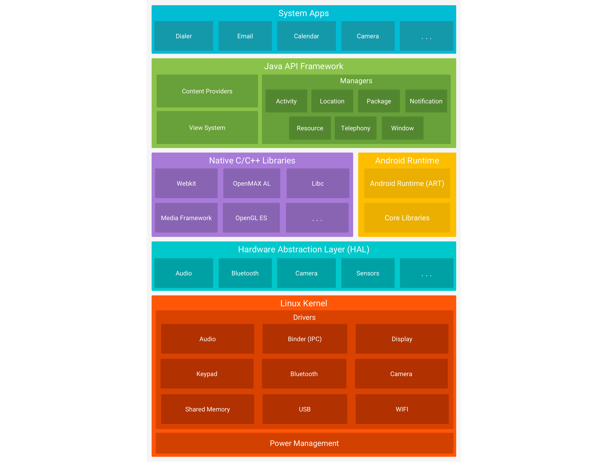

# Tema 3: Seguridad en otros Sistemas Operativos

## 3.1 Seguridad en macOS

### Autenticación local & Open Directory

- **Autenticación local**:
    - Autenticarse una sola vez y obtener:
        - Keychain del sistema,
        - Servicios de directorio para autenticación en red
- **PAM** (*Pluggable Authentication Modules*):
    - macOS, como Linux, soporta PAM
- **Open Directory**:
 Servicio de directorio que almacena información sobre la red, los usuarios y recursos. **Tres componentes** principales:
    - **Servidor LDAP** (basado en OpenLDAP)
        - Se usa en grandes organizaciones
    - **Servidor de contraseñas**
        - Controla la autenticación
        - Separado del servidor LDAP
    - **KDC** (*Kerberos Distribution Center*) para intercambiar claves de forma segura (SSO (*Single Sign-On*))
        - KDC local pero se puede conectar Open Directory al KDC de otra máquina
        - Con un solo usuario y contraseña Kerberos gestiona la autenticación a **todos** los servicios y sistemas
        - Safari, NFS, SMB, AFP, mail, Telnet, SSH, VPN, ...
- **Active Directory** (AD):
    - Permite a macOS interactuar con redes Windows
- **Tarjetas inteligentes**

### Keychain

- Es el gestor de contraseñas integrado en macOS
- Centraliza todas las contraseñas
- Triple DES
- Directorios de almacenamiento de claves

    ```bash
    ~/Library/Keychains/
    /Library/Keychains/
    /Network/Library/Keychains/
    ```

### Sistemas de permisos y autorización

- macOS hereda el sistema de permisos de UNIX
- Cuenta `root` deshabilitada por defecto
    - `sudo` para ejecutar comandos con elevación de privilegios
- Tres tipos de usuarios en macOS
    - **Usuario**: sin privilegios, solo puede modificar aspectos locales a su cuenta
    - **Administrador**: puede hacer todas las operaciones de `root` *excepto* tocar archivos del dominio del sistema
    - **Root**
- Fichero de configuración para los permisos de cada usuario:
    - `System/Library/Security/authorization`
    - `.plist` (XML)

### FileVault

- Herramienta de cifrado de disco
- AES-XTS-128 o AES-XTS-256
- Muy util para un usuario
    - En ámbitos multiusuario puede dar problemas
        - Solo es usuario que ha cifrado el disco puede descifrarlo

### GateKeeper

- Protección para aplicaciones que se descargan directamente de internet:
    - (Tiene algunas funciones como el UAC de Windows)
    - Añade atributos de metadatos en el momento de la descarga, con información como origen, fecha, hora…
    - Avisa al intentar ejecutar aplicaciones descargadas de internet
    - Si la aplicación no esta firmada genera otro aviso

### Xprotect

- Sistema de protección contra malware integrado en macOS:
    - Contiene un conjunto de firmas para malware conocido
    - Hace comprobaciones de versiones de las aplicaciones:
    - Deshabilita versiones de aplicaciones que contienen vulnerabilidades conocidas
    - Se actualiza automáticamente
    - Ficheros principales:
        - `XProtect.plist`: firmas de malware
        - `XProtect.meta.plist`: versiones de plugins contiene las versiones de los plugins
        - `Exceptions.plist`: sitios exluidos de XProtect

### Firewall

#### Application Layer Firewall (ALF)

- Firewall personal
    - Por defecto viene desactivado
- Se configura mediante una interfaz gráfica
- Permite bloquear solo las **conexiones entrantes**
- Como **política por defecto** bloquea las conexiones entrantes a software no firmado

#### Packet Filter (PF)

- Cortafuegos a más bajo nivel
    - Estilo iptables
- Se configura con:
    - `pfctl`: utilidad para configurarlo
    - `/etc/pf.conf`: fichero de configuración por defecto

### Logs

- El sistema de logs de macOS es **casi idéntico al de Linux**
- Permite loguear, entre otras cosas:
    - Autenticación (locales y remotas (SSH, VNC, ...))
    - Actividad del firewall
    - Sudo
    - Ficheros compartidos
    - Acceso web
    - DNS Lookup
    - Avisos de software de seguridad
- Los logs se guardan en /var/log:
    - `/Library/Logs`: aplicaciones comunes
    - `~/Library/Logs`: aplicaciones del usuario
- Niveles de severidad clavado al de Linux:
    - *Emergency* (Nivel 0)
    - *Alert* (Nivel 1)
    - *Critical* (Nivel 2)
    - *Error* (Nivel 3)
    - *Warning* (Nivel 4)
    - *Notice* (Nivel 5)
    - *Info* (Nivel 6)
    - *Debug* (Nivel 7)

## 3.2 Seguridad en Android

- Los dispositivos móviles son un punto de ataque en auge en los últimos años
- Android es el SO móvil más extendido

### ¿Por qué es importante la seguridad en Android?

- Muy presente en el **mundo empresarial**
    - Acceso a **información sensible**
    - Ganando terreno a servicios empresariales…
- Muy presente en la vida personal de muchas personas
    - Ventana directa a nuestra **privacidad**:
        - Multimedia
        - Conversaciones privadas
        - Emails
        - Cuentas bancarias
        - Localización
        - Gustos

### Arquitectura de Android



- Android aplica el **principio de mínimo privilegio**
    - Cada capa solo puede acceder a sus propios componentes
    - Las acciones que puede realizar cada aplicación están limitadas
- Tiene un **sistema de permisos** a nivel de API
    - Cada aplicación define que permisos necesita y los solicita al sistema
    - Los permisos están estandarizados en el sistema

### Pilares de seguridad en Android

1. **Aislamiento de aplicaciones** y **control de permisos**
    - Controlar qué pueden y no pueden hacer las aplicaciones en el dispositivo
    - De qué maneras puede afectar una aplicación maliciosa al resto del sistema
2. **Procedencia** de aplicaciones
    - ¿Se puede confiar en el autor de la aplicación?
    - ¿Las aplicaciones son resistentes a modificaciones mal intencionadas?
3. **Cifrado de datos**
    - Si perdemos/nos roban/atacan la terminal, ¿están seguros nuestros datos?
4. **Control de acceso físico**
    - Como proteger la terminal de usos no autorizados

#### Aislamiento de aplicaciones

- Por defecto todas las apps se ejecutan en su propio entorno de **Sandbox**
    - El modelo de seguridad está basado en el de UNIX
        - A cada app (cuando se instala) se le asigna un UID y un GID únicos y asocia todos los ficheros a ellos
            - Asi, solo esa aplicación tiene acceso a ellos
- Los servicios del Application Framework se ejecutan en un proceso separado (`system_server`)

- El **Kernel** de Linux es el **encargado de aislar** las aplicaciones (sandboxing).
- La máquina **Dalvik no es una limitación** en cuanto a seguridad:
    - No está enterado de los mecanismos de aislamiento
    - No hay diferencia entre programar aplicaciones de manera nativa y en Java
    - Habilita el uso de JNI (No como JavaME)

#### Permisos

- Se definen en **`AndroidManifest.xml`**
    - Todas las aplicaciones tienen ese fichero
- Ejemplos
    - **`ACCESS_FINE_LOCATION`**: Acceso a la localización exacta (GPS + LTE + WI-FI, ...)
    - **`ACCESS_WIFI_STATE`**: Acceder a información sobre las redes Wifi
    - **`CALL_PHONE`**: Permiso para poder iniciar una llamada sin pasar por el marcador
    - **`CAMERA`**:
    - **`READ_LOGS`**: Permisos para leer los registros de llamadas
    - **`READ_SMS`**:
    - **`SEND_SMS`**:
    - **`VIBRATE`**:
    - **`BRICK`**: Permiso para deshabilitar el dispositivo
    - (listado completo: <https://developer.android.com/reference/android/Manifest.permission.html>)
- Desde Android 6 se pueden controlar individualmente
- En las últimas versiones de Android se pueden dar permisos solo en *foreground*

#### Procedencia de Aplicaciones

- **Todos** los `.apk` que se suben a Google Play **deben estar firmados**
    - PROBLEMA: Pueden ser certificados autofirmados
    - **Para actualizaciones** es buena medida
        - Garantiza que la actualización la ha hecho el mismo autor
- Google Play establece una tasa y datos de tarjeta de crédito para subir aplicaciones
    - Permite **rastrear al culpable** en caso de que las aplicación sea mailiciosa
    - Solo es una medida "**disuasoria**"
- Si se habilita la instalación de `.apk` desde fuentes externas se pierde esa protección

#### Comunicación entre aplicaciones

- Las aplicaciones se ejecutan cada una en su **sandbox**
- Para comunicarse entre ellas existen diferentes mecanismos en Android_
    - ***Bundles***: para mandar información (como serializar objetos)
    - ***Binders***: para obtener referencias a otros servicios (datos +  invocar métodos)
    - ***Intents***: para invocar componentes (*Activities*)

#### Protección de memoria

Mecanismos para impedir accesos no debidos a memoria (problemas que puedan surgir de *rootear*):

- *NoExecute*: para impedir ejecución de codigo en la pila o el heap
- *ProPolice* / *safe_iop*: evitar overflows
- *calloc()*: integer overflows
- ***ASLR***: randomizar direcciones para evitar *buffer overflows*

#### Cifrado

- Por defecto, Android cifra la unidad del sistema
- AES128 + CBC + ESSIV:SHA256
- Basado en **dm-crypt* del kernel
- **No es infalible**
    - **Keylogger** en el **sector de arranque** (si no esta cifrado)
    - Ataques **Cold Boot**

### Wi-Fi en Android

- **Preferred Network List (PNL)**
    - Cada dispositivo almacena una lista de las redes a las que se ha conectado
    - Lista de SSID y su seguridad
    - Para intentar conectarse en un futuro
- **Problema con SSID oculto**:
        - Si está oculto el SSID el AP no va a mandar información de que está ahi
        - Entonces es el dispositivo **quien va preguntando por la red**
        - Con un sniffer se puede capturar esa información
        - *Rogue AP* para engañar al dispositivo
        - (Afecta mas en versiones más antiguas)

► Se identifica cada red a través
de su SSID (nombre de la red)
y su seguridad.

### "Rootear"

- *Rootear* tiene ventajas
    - Instalar ROMs
    - Quitar bloatware
    - Corregir fallos
    - Mantener terminales antiguos
    - ...
- Antes tenía más sentido
- Ahora tiene **más desventajas que ventajas**
    - Vulnerabilidades a nivel de kernel
    - Vulnerabilidades de diferentes tipos
    - Si una app explota una de esas vulnerabilidades ***you've been fucked***

### Recomendaciones

- **Actualizar** sistema operativo
- **No** descargar aplicaciones de **markets desconocidos**
- Cuidado con las actualizaciones de las apps
- **No rootear** el teléfono
- **Cifrar** el dispositivo
- Deshabilitar servicios cuando no se usen
- Desinstalar apps cuando no se usen

## 3.3 Seguridad en iOS

### Arquitectura

- Arquitectura por capas, como en Android

### Seguridad del Sistema

- Arranque seguro:
    - Boot ROM (Apple CA Root) → iBoot → iOS Kernel (XNU).
- **Autorización del software** de sistema
    - ID único para cada SoC (ECID - Exclusive Chip Identification)
    - Solo se puede actualizar el sistema a través de Apple
- Protección de **integridad**
    - **Kernel Integrity Protection (KIP)**
    - Pointer Authentication Codes (PAC)
        - Previene técnicas ROP (Return Oriented Programming)
    - Coprocesadores: Sensor imagen, Sensor movimiento, Secure Enclave
- **Secure Enclave**
    - **Coprocesador** que realiza las **operaciones de seguridad**
    - Gestiona las **claves de cifrado** del dispositivo
    - Realiza autenticación biométrica de **TouchID y FaceID**

### Autenticación

- Passcodes
- TouchID
- FaceID

### Proteccioón de datos

►
Cifrado con soporte hardware:
▪
Modulo AES-256 entre memoria flash y RAM

jerarquía de claves para cifrar cada fichero con una clave
diferente (que se mezclan con el UID del dispositivo):

- Borrado de seguridad
- Para borrar el dispositivo completamente (wipe) basta con olvidar sus claves.
- Las aplicaciones pueden especificar la clase de protección  para los archivos de las aplicaciones

Seguridad de las Apps

- **"Walled Garden"**:
    - Solo se pueden instalar Apps de la **AppStore**
        - Todas las apps tienen que estar **firmadas** por Apple + Desarrollador
        - **Proceso para entrar** en la store más **largo y restrictivo**
    - Hay limitaciones incluso desde entornos de desarrollo (Xcode)
    - Al instalar la aplicación, se cifra con las claves del dispositivo
    - Se comprueba la firma cada vez que se instala
    - La firma se comprueba cada vez que se ejecuta
    - Además:
        - Address Space Layout Randomization (ASLR)
        - ARM Execute Never (XN)
- **App Sandboxing** (Seatbelt)
    - Basado en TrustedBSD
    - Todas corren **bajo el mismo usuario** (diferente a Android)
    - `.plist` con los **Entitlements** permitidos a la aplicación

### Privacidad

- Mejores controles de privacidad

### Seguridad de Red

- TLS (v1.2) y DTLS para las aplicaciones
- VPN:
    - Procotolos: IKEv2/IPSec, SSL-VPN, L2TP/IPSec
    - Modos: VPN On Demand, Per App VPN y Always-on VPN
- **Wi-Fi utiliza direcciones MAC aleatorias**
    - En cada trama de escaneo activo (WiFi Probes)
    - La MAC cambia cada vez que se desconecta de un AP
    - A partir de iPhone 6S, solo se anuncian de los SSID ocultos
- **Mitiga ataques al Wi-Fi y baseband** limitando la memoria a la que puede acceder por DMA:
    - Bus PCIe dedicado por interfaz.
    - IOMMU limita acceso a páginas de memoria con paquetes
- La antena **NFC** está reservada **para el Secure Element** de Apple Pay

### Jailbreak

- Equivalente a "Rootear" un Android
    - Pero no se suele modificar el arranque.
- Para instalar aplicaciones o activar características no permitidas por Apple
    - Suelen instalar un gestor de paquetes alternativo (Cydia)
- Requiere vulnerabilidades de escalado de privilegios
    - Cada vez más difíciles de encontrar
    - Apple actualiza los sistemas para parchearlas y no deja instalar versiones vulnerables
