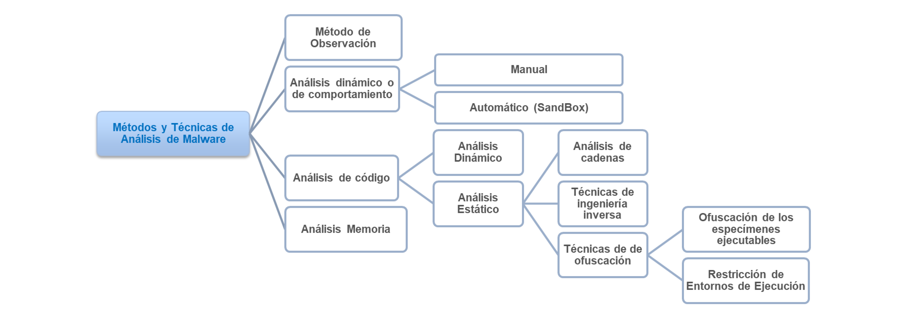

# Tema 4: Análisis de malware

## 1. Introducción y objetivos

> Malware (INCIBE): «término genérico utilizado para referirse a cualquier tipo de software malicioso o molesto que puede instalarse en los sistemas informáticos para llevar a cabo acciones sin el conocimiento del usuario»

- El software crece cada vez más en complejidad
    - Cada vez hay un mayor número de vulnerabilidades
- El malware también crece en cantidad y complejidad
- **Análisis de malware**
    - Toda una serie de técnicas parar extraer información de un malware

### Objetivos

- Conocer el **origen de un ataque** e identificar al intruso
- **Evaluar la capacidad de detección** de malware de los sistemas de protección
- **Evaluar los daños causados** por el malware
- **Descubrir otras máquinas** que han sido afectadas por el mismo malware
- Identificar la vulnerabilidad que fue aprovechada por el malware,
    - Para obtener la actualización para mitigarlo
- Obtención de **datos necesarios para poder implementar defensas** necesarias
- **Determinar el nivel de sofisticación** y complejidad del malware

## 2. Tipos de malware

- El malware se puede transmitir y puede llegar a máquinas de muchas maneras
- **Mecanismos de propagación** de malware:
    - Infección de aplicaciones
    - Anexos de correos electrónicos
    - Suplantación de ficheros
    - Backdoors
    - Transferencia de ficheros a través de la red.
    - Dispositivos extraibles
    - Phishing
    - Redes sociales
- Clasificar malware es difícil debido a que hay muchos tipos y comparten muchas características entre diferentes tipos
- **Tipos** de malware:
    - **Virus**: malware capaz de replicarse
    - **Gusanos**: malware autónomo que se replica a través de una red
    - **Troyanos**: malware que se hace pasar por software legitimo con fines maliciosos
    - **Backdoors**: malware que crea un canal de entrada para abrir paso a un atacante para realizar acciones maliciosas
    - **Keyloggers**: malware que captura pulsaciones de teclas para robar información privada como, por ejemplo, contraseñas o números de tarjetas de crédito
    - **Spyware**: malware usado para obtener información de una víctima sin su conocimiento
    - **Adware**: malware que permite inyectar anuncios a sus víctimas
    - **Rootkits**: malware que se integra en las capas bajas del sistema para intentar con el objetivo de tomar control total del equipo
    - **Botnet**: malware que infecta maquinas con el objetivo de poder controlar un gran número de ellas remotamente para acciones maliciosas
    - **Spammers**: malware que envía correo electrónico no solicitado de forma masiva a través de Internet
    - **Ransomware**: Malware que bloquea el acceso a recursos o datos del sistema para exigir un rescate a cambio de liberarlos
    - **Rogueware**: Malware que se hace pasar por malware para intentar obtener beneficio económico de las víctimas a través de la extorsión
    - **Advanced persistent threat (APT)**: ataque organizado y prolongado en el tiempo que hace uso de diversos tipos de técnicas, exploits y malwares
- **MAEC** (*Malware atribute enumeration and characterization*)
    - Formato de caracterización de malware creado por el MITRE

## 3. Obtención del malware

- Antes de poder analizar malware, hay que obtenerlo
- **Formas de obtención** de malware:
    - Páginas de Internet
    - Motores de búsqueda
    - Capturándolo en una máquina infectada de la organización
    - Capturándolo en una honeynet, honeypot y honeytokens
        - Honeypot
            - Sistema real o simulado con vulnerabilidades deliberadas para observar intrusiones e obtener malware
            - *Clasificación de tipos*
                - Uso
                    - Investigación: para estudiar las técnicas de ataques
                    - Producción: para evaluar como mejorar las defensas de la organización
                - Implementación
                    - Física: caro pero más realista
                    - Virtual: barato pero menos realista
                - Tipo de interacción
                    - Baja interacción: bajo riesgo pero emulación limitada (servicios, vulnerabilidades concretas, ...)
                    - Alta interacción: mayor riesgo pero simulan sistemas enteros y la información es más valiosa
            - Ejemplos: Suricata, honeytrap
        - Honeynet
            - Red con uno o más honeypots
            - Buscan simular redes o entornos enteros
            - *Requisitos*
                - Control de datos
                - Captura de datos
                - Recolección y análisis de datos
            - Ejemplos: Modern Honey Network (MHN), T-Pot

## 4. Entorno y herramientas análisis de malware

### Herramientas

- Para analizar malware existen muchos tipos de herramientas que permiten obtener información tanto de sus características como de su comportamiento
- Las diversas herramientas permiten **funcionalidades como**:
    - **Clasificación de binarios**
    - Motores antivirus
    - **Análisis de strings**
    - Análisis de **cambios en la máquina**
    - Análisis de **trafico y simulación de servicios de red**
    - Análisis de imágenes de disco
    - **Análisis de memoria**
    - **Análisis de binarios**
    - **Análisis estático** de código
    - **Análisis dinámico** de código

### Arquitectura

- El **laboratorio** de análisis de malware puede ser tanto físico como virtual
    - Hay malware que tienen mecanismos para detectar VM
    - En general, la opción mas fácil y flexible es hacer uso de un **entorno virtual**
        - Las VM proporcionan **snapshots**
- *Componentes* del entorno
    - **Víctima**
        - Es el equipo virtual que será infectado
        - Se suele dotar con herramientas para hacer el análisis y extraer la información de la muestra
    - **Servicios**
        - Tanto en la misma maquina como en otras
        - Permites simular servicios para hacer el entorno mas realista y obtener más información (HTTP, DNS, DHCP, FTP, SMB, ...)
- Se debe llevar un adecuado **control de la integridad** de las herramientas y el entorno mediante uso de **hashes** durante el proceso de análisis

## 5. Métodos de análisis de malware

- **Análisis dinámico**: analizar el comportamiento del binario en ejecución
    - **Manual**: usar programas de monitorizacion para obtener información, ejecutando la muestra manualmente
        - *Ejemplos*: Procmon, Procesp, Regshot
    - **Automático**: usar entornos integrados que automatizan el proceso de análisis del comportamiento
        - *Ejemplos*: Cuckoo
- **Análisis de código**
    - **Estático**: usar herramientas de reversing (desensabmladores, decompiladores, ...) para obtener información sobre el comportamiento del malware
        - *Ejemplos*: IDA PRO, Ghidra
    - **Dinámico**: usar depuradores para analizar el código mientras se ejecuta
        - *Ejemplos*: OllyDbg, x64dbg

## 6. Metodología de análisis de malware

- Usar una metodología para analizar malware permite agilizar y estandarizar los procesos
- Fases de una metodología de análisis de malware:
    1. **Acciones iniciales**: preparar todo el entorno para partir de una referencia
    2. **Clasificación**: usar herramientas de análisis estático para obtener información preliminar sobre la muestra que sirva para futuras fases
    3. **Análisis de código**: analizar el código (estático + dinámico)
    4. **Análisis dinámico o de comportamiento**: analizar el comportamiento del malware mientras se ejecuta y el comportamiento de su código
- El proceso se puede reglamentar a medida que las fases vayan proporcionando más información

### Acciones iniciales

1. Realizar una **línea base de la configuración del sistema** víctima (foto instantánea)
    - Hashear elementos importantes (archivos del sistema, imagen)
2. Tomar **instantánea** del sistema
3. **Desactivar servicios** de actualización y servicios anti-malware
4. Antes de comenzar el análisis
    - Comprobar **integridad**
5. Tomar otra instantánea
6. Grabar el trafico entre la maquina host y la virtual para comprobar que no se transmite nada

### Clasificación

1. **Transferir** el malware al entorno de pruebas
2. **Identificar** el malware
    - Calcular firmas
3. **Clasificación del tipo** de malware
    - Uso de sistemas antivirus o servicios como VirusTotal
    - YARA
    - Ssdeep
4. Búsqueda de información en fuentes abiertas (OSINT)
    - Clasificaciones de malware 🠒 MAEC
5. **Búsqueda de strings**
6. **Identificar técnicas de ofuscación**
    - Empaquetamiento
    - Encriptado
    - Polimorfismo
    - Metamorfismo
7. **Estudiar el formato** del fichero
    - Headers (MS-DOS, MS_DOS stub, PE header, ...)
    - Secciones (.text, .data, .rsrc, .upx, ...)
    - File alignment vs. memory Alignment
    - Estructuras claves
    - Imports
8. **Elementos de interés**
    - Archivos con entradas TLS
    - Entradas sospechosas en la tabla IAT (Import Address Table)
    - EntryPointAddress sospechosos
    - Secciones con tamaño cero
    - Secciones con entropia alta
    - Fechas invalidas
    - Información de version del archivo

- *Herramientas*: DependencyWalker, PEBrowse, PEiD, pestudio, ...

### Análisis de código

1. Comprobación del funcionamiento general del mismo
2. **Análisis estático de código**
    - Mediante un desensamblador y transformadores de código ensamblador a lenguaje de alto nivel
3. **Análisis dinámico de código** mediante un depurador

- *Herramientas*: IDA Pro, Ghidra, PE Explorer, OllyDbg, x64dbg

### Análisis dinámico o de comportamiento

1. **Preparación** y/o ejecución **de herramientas** de:
    - Monitorización de **procesos**
    - Monitorización del **sistema de archivos**
    - Supervisión del **registro**
    - Monitorización de la **red**
    - Análisis de **memoria**
2. **Ejecutar** el malware
3. Proporcionar servicios al malware
4. **Tareas post-ejecución** del malware
5. **Volcado y análisis de la memoria**
6. **Análisis del disco duro**

- *Herramientas*: Systracer, procmon, ProcessHacker, TCPview, RegShot, AutoRuns, Netcat, Wireshark, Volatility, Spymetool
